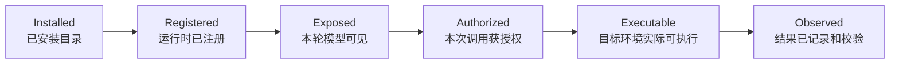

# 企业级智能体自带工具体系深度调研与落地报告

> 调研日期：2026-07-20  
> 适用对象：Agent Runtime、企业智能体平台、Coding Agent、办公自动化 Agent 的产品、架构、安全与测试团队  
> 结论性质：公开实现事实、TMA 当前实现事实与本文建议值分开陈述；建议值不是外部产品的默认配置。

## 0. 执行摘要

智能体工具体系的核心问题不是“该内置多少工具”，而是四件事能否同时成立：模型能找到正确工具，调用不会越权，结果不会冲垮上下文，失败后能够恢复。

本次调研的主要结论如下。

1. **工具目录、模型可见工具、当前获授权工具、实际可执行工具必须是四个不同集合。** 安装了一个工具，不等于应把它的完整 schema 放进每轮上下文，更不等于允许模型执行。
2. **权限判定和运行时隔离是两层控制。** 权限系统回答“这次调用能不能开始”，沙箱回答“开始后最多能碰到什么”。只做命令字符串审批，无法约束获准进程的子进程和间接行为；只做沙箱，也无法阻止在沙箱允许范围内发生的错误副作用。[1][2]
3. **默认工具数量应由 schema token 预算和离线选择准确率决定，而不是写死为 12～16。** Anthropic 当前建议工具达到 10 个、定义超过 10k tokens 或选择准确率下降时使用 Tool Search；其文档指出，30～50 个工具后选择质量通常开始下降。Hermes 则按可延迟工具 schema 占上下文比例自动决定是否启用工具检索。[3][4]
4. **通用企业 Agent 建议常驻 8～12 个工具 schema，其中只有 3～5 个最高频工具保持“热加载”。** 浏览器全集、Office/PDF、MCP、记忆、定时任务和子 Agent 按场景或检索结果加载。
5. **专用工具优于万能 Shell，但 Shell 不能消失。** 文件读取、搜索、精确编辑、网页抓取应走专用工具；构建、测试、系统诊断和长尾 CLI 仍需要 Shell。正确做法是把 Shell 降级为受沙箱、网络策略、输出预算和进程生命周期约束的兜底执行面。
6. **工具返回值必须分成模型内容、结构化状态、UI 状态和 Artifact。** LobeHub 当前内置工具架构明确区分 LLM-facing `content` 与 result-domain `state`；MCP 也同时支持 `structuredContent`、`outputSchema` 和多媒体内容。把所有结果拼成一段字符串，会同时损害可验证性、UI 和上下文预算。[5][6]
7. **分页不只是 `offset + limit`。** 企业级文件读取至少需要模式互斥、1-based 行号、UTF-8 边界、稳定 revision、截断原因、继续指针和重复读取断路。TMA 当前的大文件读取设计已覆盖这组关键能力，是现有实现的强项。
8. **风险不能只分 read/write/exec。** “在工作区改一行代码”和“点击网页上的提交/转账/删库”都可被粗略归为 write，但审批语义完全不同。建议增加副作用域、可逆性、数据敏感度、外发目标和凭据使用五个维度。
9. **MCP 是动态工具来源，不是可信边界。** MCP 规范要求输入校验、访问控制、限流、输出清洗、超时和审计，并明确提醒客户端不要默认信任工具 annotations。企业 Runtime 还需防范 token passthrough、SSRF、恶意本地 MCP 启动命令和工具目录变化。[6][7]
10. **子 Agent 是上下文隔离和并行机制，不是权限放大器。** 工具集、递归深度、并发、预算、交互能力和结果回收都必须裁剪。父 Agent 只回收摘要、结构化结果、证据引用与 Artifact，不应灌回完整子上下文。[8]
11. **工具设计会显著影响智能体能力。** SWE-agent 的 Agent-Computer Interface 研究说明，针对模型设计的文件导航、编辑和执行界面本身就是性能变量，不是普通 API 包装工作。[9]
12. **TMA 当前不是“从零开始”。** 它已经具备 schema 双重校验、分页 revision、结果上下文预算、审批续跑、MCP SSRF 防护、Skill 安装扫描和子 Agent 配额。近期最值得补的是渐进式工具暴露、更丰富风险元数据、结构化输出 schema、进程工具，以及文件写入的并发前置条件。

## 1. 调研范围与证据口径

本报告采用三类证据：

| 证据级别 | 来源 | 用法 |
|---|---|---|
| A | 官方协议、官方产品文档、固定版本规范 | 判断已承诺的行为和安全要求 |
| B | 开源仓库固定 commit 的实现与开发文档 | 判断真实架构、边界和工程取舍 |
| C | 本仓库代码、测试与设计文档 | 判断 TMA 已实现能力和待补缺口 |

调研对象包括 Claude Code、Hermes Agent、LobeHub、MCP、SWE-agent ACI 研究，以及 TMA 当前实现。需要注意：

- Claude Code、Hermes 和 LobeHub 都在快速演进，本文不把历史版本行为当成当前事实。
- “LobeHub”在当前仓库中已不只是早期 LobeChat 插件系统，其内置工具已形成 manifest、runtime、executor、UI surfaces 和 registry 的分层架构。[5]
- “Claude Code 几乎全靠 Bash”已不是准确描述。当前官方文档明确列出只读文件工具、Bash、文件修改、WebFetch、MCP、Agent 等不同权限规则，并将权限与 Bash 沙箱分层处理。[1][2]
- 所有数值型门槛在正式上线前都应通过目标模型、目标任务集和真实工具 schema 重新评测。

## 2. 先统一五个概念

很多工具系统的混乱，来自把以下状态混为一谈。



| 状态 | 必须回答的问题 | 常见错误 |
|---|---|---|
| Installed | 包是否存在、来源是否可信、版本是否固定 | 安装即自动启用 |
| Registered | manifest 是否合法、依赖是否满足 | 坏 schema 到调用时才报错 |
| Exposed | 本轮是否值得消耗上下文展示给模型 | 40+ schema 每轮全塞 |
| Authorized | 当前用户、会话、资源和具体参数是否允许 | 只按工具名审批，不看参数 |
| Executable | worker、沙箱、网络、凭据和依赖是否真实可用 | schema 宣称可用，环境实际缺失 |
| Observed | 输出、审计、证据、Artifact 是否完整 | 执行成功但无法证明做了什么 |

这五层应该分别有状态和错误码，不能用一个 `enabled: true` 代替。

## 3. 公开实现对比：真正值得借鉴什么

| 系统 | 工具暴露 | 权限与隔离 | 上下文控制 | 编排 | 最值得借鉴的点 |
|---|---|---|---|---|---|
| Claude Code | 内置文件、搜索、编辑、Bash、Web、MCP、Agent 等；支持规则级裁剪 | deny > ask > allow；只读、Bash、文件修改分级；Bash 另有 OS 级文件和网络沙箱 | 子 Agent 隔离上下文；平台 Tool Search 支持延迟加载 | 子 Agent 可限制工具、模型、最大轮次和 worktree 隔离 | 权限与沙箱分层；组织 managed settings；子 Agent 工具裁剪 [1][2][8] |
| Hermes | 40+ 工具按 toolset 管理；核心工具直载，MCP/插件可延迟 | 本地、Docker、SSH、Singularity、Modal、Daytona 多执行后端；审批、hooks、guardrail | Tool Search 在 schema 占窗口达到阈值时启用；工具结果有预算和重复调用断路 | `delegate_task`、并行工具执行、进程工具 | 工具检索的渐进披露；重复失败/无进展断路；后端可替换 [4][10] |
| LobeHub | builtin tool package + registry；manifest 与 UI 解耦 | manifest 支持 human intervention 与 client/server executor | `content` 面向 LLM，`state` 面向结果/UI；运行时输出统一 | Task、Agent Team、调度等作为业务工具 | 一个工具的“五张面孔”：manifest、runtime、executor、UI、registry [5] |
| MCP | 服务器动态暴露 tools；`tools/list` 支持分页与 list changed | 协议不替客户端做审批；要求输入校验、访问控制、限流、输出清洗 | 结构化/非结构化内容、resource link、output schema | 本身不是 Agent 编排协议 | 动态目录、结构化输出、稳定协议错误与执行错误分离 [6][7] |
| TMA 当前 | 默认 registry + tools 过滤 + MCP 动态注册 | read/write/exec 风险，intervention mode，worker/runtime 选择 | 大文件分页、结果二级预算、历史压缩、schema token 计量 | 持久化 subagent、group、discussion、quota、审批续跑 | 已有企业运行时骨架；分页、审批恢复、MCP 治理和证据门禁较完整 |

跨系统真正形成共识的不是某个工具名字，而是以下模式：

- 高频、低歧义、低成本工具直接暴露。
- 长尾工具通过 toolset、skill、MCP 或 Tool Search 按需加入。
- 执行权限由 Runtime 强制，不依赖系统提示词。
- 大输出必须分页、截断或落 Artifact。
- 工具调用和结果必须拥有稳定 ID，以支持审计、恢复和幂等。
- 交互型、执行型、媒体型结果使用不同通道。

## 4. 推荐的默认工具集

### 4.1 推荐基线

通用企业智能体建议默认注册以下 12 个工具 schema。这里的“默认”指常见会话可见，不代表无审批执行。

| 工具 | 默认可见 | 默认风险 | 建议审批 | 边界 |
|---|---:|---|---|---|
| `read_file` | 是 | R0 本地只读 | 工作区内自动 | 只读文本页；媒体和复杂文档分流 |
| `search_files` | 是 | R0 本地只读 | 自动 | 路径 glob + 内容搜索；结果有上限 |
| `edit_file` | 是 | R2 本地可逆写 | 首次/策略审批 | 精确替换或 patch；需 revision/read receipt |
| `write_file` | 是 | R2 本地覆盖写 | 首次/覆盖审批 | 小文件与骨架；不是无限流上传 |
| `run_command` | 是 | R3 代码执行 | 沙箱内按策略；外部副作用逐次审批 | CLI 兜底，不替代 read/search/edit |
| `process` | 是 | R1/R3 | kill/write 视风险审批 | poll/log/wait/kill/write；管理后台任务 |
| `execute_code` | 是 | R3 代码执行 | 沙箱策略 | 短脚本、解析和批处理；非任意宿主逃逸 |
| `web_search` | 是 | R1 公网读 | 企业网络策略 | 只返回标题、摘要、URL 与来源元数据 |
| `web_fetch` | 是 | R1 公网读 | 新域名/敏感目标审批 | 静态抓取；SSRF 和重定向逐跳校验 |
| `ask_user` | 是 | 交互 | 不适用 | 仅处理不可安全推断的关键缺口 |
| `task_plan` | 是 | R0/R1 状态写 | 自动 | create/update/get/complete 可做成同一 namespace 多 API |
| `activate_skill` | 是 | R0 读 | 自动；安装另行审批 | 加载冻结版本说明，不授予新权限 |

这 12 个工具只有在 schema 总量可控时才应全部直载。建议同时设置两道门槛：

- 常驻工具 schema 估算不超过当前模型上下文的 **8%**，10% 为硬告警线。
- 常驻工具总定义不超过 **10k tokens**；超过后启用 Tool Search 或场景化 toolset。

高频的 3～5 个工具应保持非延迟加载，例如 `read_file`、`search_files`、`edit_file`、`run_command`、`ask_user`。其余可根据任务分类器、Agent 配置或首次检索结果加载。Anthropic 文档给出的“10 个工具/10k tokens”是启用工具检索的评估起点，不是所有模型的普适定律。[3]

### 4.2 按场景加载

| 场景 | 加载 | 默认不加载 |
|---|---|---|
| 纯 Coding | LSP、git 专用操作、测试/诊断工具 | browser、Office、memory write |
| 文档与数据 | document extract/render、spreadsheet、artifact | browser click/type、subagent |
| RPA/运营 | browser 5 件套、upload/download、外部系统 connector | 深文件编辑、LSP |
| 研究分析 | web crawl、PDF、citation、数据执行 | browser 写操作、local exec |
| 多 Agent | spawn/wait/collect/cancel，结果 schema | 默认用户交互、无限再委托 |
| 企业集成 | MCP Tool Search、resource/prompt bridge | MCP 全目录直载 |

### 4.3 不建议默认暴露

- `memory_write`：跨会话持久化影响长期行为，应有明确写入策略和可见 UI。
- `cron_create`：是未来副作用，不应被当作普通状态写。
- `send_message`、`submit_form`、`purchase`：属于外部副作用，应按目标系统和参数审批。
- `spawn_agent`：只有长任务或明确编排型产品默认打开。
- MCP 全量工具：先注册目录，再按 session scope 检索和授权。
- 浏览器 10～15 个细粒度 API：优先收敛成 5～7 个稳定动作。

## 5. 统一工具契约

### 5.1 Manifest 建议

工具定义不能只有 name、description 和 input schema。建议最少包含：

```json
{
  "name": "default.read_file",
  "version": "1.2.0",
  "description": "Read one bounded UTF-8 page from a workspace file.",
  "input_schema": {},
  "output_schema": {},
  "risk": {
    "class": "read",
    "effects": ["filesystem.read"],
    "scope": "workspace",
    "reversibility": "not_applicable",
    "credential_use": false,
    "external_side_effect": false
  },
  "limits": {
    "timeout_ms": 10000,
    "max_result_chars": 12000,
    "max_artifact_bytes": 8388608
  },
  "runtime": {
    "allowed": ["cloud_sandbox", "local_system"],
    "preferred": "cloud_sandbox"
  },
  "idempotency": "safe",
  "annotations_trusted": true
}
```

必须在注册时校验 manifest 自身。坏 manifest 应失败关闭，不能等到模型第一次调用才发现。

### 5.2 Call envelope 建议

```json
{
  "protocol_version": "agent.tool_call.v1",
  "call_id": "call_01J...",
  "tool": "default.edit_file",
  "arguments": {},
  "idempotency_key": "sha256:...",
  "deadline_ms": 30000,
  "session_id": "ses_...",
  "turn_id": "turn_...",
  "parent_call_id": null,
  "approved_scope_ref": "apr_..."
}
```

约束：

- `call_id` 由 Runtime 生成或规范化，不能仅信任模型提供。
- 参数先做 JSON Schema 校验，再进入审批，再进入 executor，executor 边界再次校验。
- `idempotency_key` 对外部写、文件写、消息发送和任务创建是必需字段。
- `deadline_ms` 是整次调用 deadline，不只是 HTTP client timeout。
- 审批引用必须绑定 user、workspace、tool、规范化参数范围和过期时间。

### 5.3 Result envelope 建议

```json
{
  "protocol_version": "agent.tool_result.v1",
  "call_id": "call_01J...",
  "status": "success",
  "content": [
    {"type": "text", "text": "model-visible bounded summary"}
  ],
  "structured_content": {},
  "state": {},
  "pagination": {
    "truncated": false,
    "next_cursor": null,
    "revision": "stat-v1:..."
  },
  "artifacts": [],
  "error": null,
  "metrics": {
    "duration_ms": 24,
    "input_bytes": 120,
    "output_bytes": 4096
  }
}
```

`status` 建议固定为：

- `success`
- `partial`
- `pending_approval`
- `running`
- `canceled`
- `timeout`
- `error`

模型看到的 `content`、程序消费的 `structured_content`、UI 使用的 `state` 和用户下载的 `artifacts` 必须分开。若提供 `output_schema`，Runtime 应验证 `structured_content`；MCP 规范同样建议客户端验证结构化输出。[6]

### 5.4 稳定错误码

错误至少包含 `code`、`retryable`、安全文案和有限 details。建议基础集合：

| 类别 | 错误码示例 | 是否可重试 |
|---|---|---:|
| 参数 | `invalid_tool_arguments`、`conflicting_pagination_mode` | 修正后可重试 |
| 权限 | `approval_required`、`permission_denied`、`scope_violation` | 取决于审批 |
| 文件 | `not_found`、`not_text`、`stale_file_revision`、`match_not_unique` | 多数可恢复 |
| 执行 | `command_failed`、`timeout`、`process_not_found` | 取决于原因 |
| 网络 | `ssrf_blocked`、`redirect_blocked`、`rate_limited` | 有限重试 |
| MCP | `mcp_transport`、`mcp_protocol`、`mcp_circuit_open` | 有限重试 |
| 系统 | `invalid_tool_schema`、`executor_unavailable` | 模型不应盲重试 |
| 断路 | `repeated_failure_blocked`、`no_progress_blocked` | 必须换策略 |

错误 details 不应回显 token、完整环境变量、敏感参数、远端响应正文或内部绝对路径。

## 6. 文件工具：最容易低估的工程面

### 6.1 `read_file`

建议支持三种互斥模式：

| 模式 | 参数 | 适用 |
|---|---|---|
| auto | 仅 `path` | 小文件整读，大文件首个默认页 |
| line | `start_line` + `max_lines` | 代码、配置、普通文本 |
| byte | `offset_bytes` + `max_bytes` | 超长行、日志、生成数据、随机定位 |

推荐默认值：

- 小文件阈值：8 KiB。
- 默认页：8 KiB 或 200 行，先达到者为准。
- 单次硬上限：64 KiB；管理员可调，但模型不能请求无限值。
- 行号统一 1-based。
- 文本输出使用 `LINE|CONTENT`；byte mode 若无法在 O(page) 成本内确认绝对行号，明确返回 unknown，不能伪造。

必须处理：

- UTF-8 offset 落在 continuation byte 时，移动到合法 rune 边界并返回 requested/actual offset。
- 开始和结束各检查一次 revision，避免读取过程中被替换。
- continuation 必须携带上一页 revision；不匹配返回 `stale_file_revision`。
- 同一 call signature 和相同 revision 连续返回同一窗口时，第二次给出 no-progress 提示，达到阈值后断路。
- 拒绝设备文件、FIFO、socket、过深符号链接和超出 workspace root 的解析路径。
- MIME/魔数优先于扩展名；图片、PDF、Office 和压缩包分流。

TMA 当前 `docs/large-file-reading.md` 已采用 8 KiB 默认页、64 KiB 硬上限、line/byte 互斥、stat fingerprint revision、UTF-8 边界和 `search_file` 定点读取，可直接作为基线。

### 6.2 `search_files` 与 `search_file`

两者不是重复工具：

- `search_files`：跨文件内容检索和路径 glob，适合仓库探索。
- `search_file`：单个超大文件的字面量定点搜索，适合避免逐页扫描。

必须限制文件数、总扫描字节、匹配数、单行预览和耗时。返回值应含 path、1-based line、raw byte offset、preview、revision 和 `truncated_matches`。

企业默认不建议让搜索跟随工作区外符号链接，也不建议默认搜索 `.git`、依赖缓存、凭据目录和二进制文件。

### 6.3 `write_file`

写文件建议增加：

- `mode: create | overwrite | create_or_overwrite`
- `expected_revision` 或 `expected_absent: true`
- `content_sha256`
- `idempotency_key`
- `create_parents` 显式开关
- 写临时文件、`fsync`、同目录原子 rename

覆盖已有文件的风险高于创建新文件，应能单独设策略。大文件使用 skeleton + placeholder 是可行协议，但它解决的是模型输出和审批续跑，不替代原子写、revision 和磁盘配额。

### 6.4 `edit_file` / `patch`

建议保留两类 API：

- `edit_file`：精确文本替换，要求 old string 唯一或显式 `replace_all`。
- `apply_patch`：多 hunk、有上下文的补丁，适合代码修改。

共同要求：

- 修改前有同 revision 的 read receipt，或调用显式携带 `expected_revision`。
- 匹配 0 次与多次使用不同错误码。
- 写入后返回新 revision、changed range、diff summary 和完整内容 Artifact 引用，而不是把整文件回灌模型。
- 普通编辑和 segmented generation 使用不同幂等策略。placeholder 重试必须校验 placeholder 与 segment hash 的绑定关系。

## 7. 执行工具：命令、进程与代码应拆开

### 7.1 `run_command`

推荐优先使用结构化 argv：

```json
{
  "command": "go",
  "args": ["test", "./internal/tools"],
  "work_dir": ".",
  "timeout_ms": 120000,
  "background": false,
  "stdin": null,
  "env_refs": ["TEST_DATABASE_URL"],
  "output_paths": []
}
```

只有明确 `shell: true` 时才交给 `sh -c`，并提升风险。否则系统不应把数组重新拼成 shell 字符串。

执行面必须定义：

- cwd canonicalization 和 workspace/sandbox 边界。
- 环境变量 allowlist；secret 以引用注入，日志只记录 key name。
- stdout、stderr 分开，流式 chunk 有 seq，结果有累计 byte 和截断标记。
- timeout 到期后杀整个 process group，而不是只杀父 PID。
- CPU、内存、PID、磁盘、网络与 wall-clock 限额。
- 命令结束后返回 exit code、signal、duration、截断状态和 Artifact。
- `sudo`、宿主 Docker socket、云 metadata、SSH agent、浏览器 profile 等高价值接口默认不可见。

### 7.2 `process`

后台任务不能靠重复 `run_command` 管理。建议提供：

- `list`
- `poll`
- `log(cursor, limit)`
- `wait(timeout)`
- `write(stdin)`
- `kill(signal)`

进程句柄必须绑定 workspace/session/runtime，设置 TTL，服务重启后能明确返回“不可恢复”或从 worker 重建状态。`kill` 和 `write` 不是只读操作。

### 7.3 `execute_code`

`execute_code` 的价值是把数据变换和解析收敛到可控模板：语言、代码、输入 Artifact、输出路径和依赖策略。它不应只是 `run_command("python -c ...")` 的别名。

建议：

- 仅支持显式语言集合。
- 默认无网络、只读输入、独立临时目录。
- 包安装单独审批或使用预构建镜像。
- 代码、stdout 和异常分别限额。
- 输出文件必须显式声明，扫描后再发布 Artifact。

Claude Code 的当前实践说明，命令审批和 OS 级沙箱应叠加；Hermes 的多后端设计则说明执行环境是 provider 能力，不应写死在工具名称里。[2][10]

## 8. 网络工具：搜索、抓取与浏览器各司其职

### 8.1 `web_search`

只返回标题、摘要、URL、来源、发布时间和排序/检索元数据。默认 5～10 条，硬上限 30 条。不要自动抓取每个结果正文。

应记录 query、provider、耗时、结果数和失败分类，但不要把用户身份、私密 query 或完整响应放进低权限日志。

### 8.2 `web_fetch`

适用于静态 HTML、文本和可直接抽取的公开 PDF URL。必须具备：

- URL scheme allowlist。
- 解析前和连接后都检查 IP；阻断 loopback、link-local、metadata 和私网，除非管理员显式允许。
- 每一跳重定向重新做同样校验。
- DNS 结果 pinning 或 egress proxy，降低 DNS rebinding/TOCTOU 风险。
- Content-Length 和流式实际下载双重上限。
- MIME 分流、正文字符上限、超时和压缩炸弹防护。
- 返回 `source_trust=untrusted_external_content`，提醒模型网页正文不是系统指令。

MCP 安全最佳实践对 OAuth discovery 的 SSRF、重定向和 DNS rebinding 给出了同样要求，可直接复用于通用抓取器。[7]

### 8.3 浏览器精简集

建议最小集合：

- `browser_open`
- `browser_snapshot`
- `browser_click`
- `browser_type`
- `browser_screenshot`
- 可选 `browser_download` / `browser_upload`

关键约束：

- click/type 使用 snapshot ref，ref 绑定 page revision/DOM epoch；过期返回 `stale_element_ref`。
- CSS selector 仅作开发或兼容逃生口，不应是模型默认定位方式。
- “点击”不是统一风险。展开菜单是 UI 内部状态；提交表单、发消息、购买、授权、删除是外部副作用，应在 action-time 审批。
- type 可能传输敏感数据。Runtime 必须知道目标 origin、字段类型和数据分类。
- 截图保留原始 viewport、缩放比例和像素尺寸，供坐标映射。
- MFA、验证码和账号授权通过人工接管，不绕过安全流程。

## 9. 媒体、PDF 与 Office：不要伪装成文本文件

推荐统一做 MIME 路由，而不是给 `read_file` 堆大量格式分支：

| 输入 | 路由 | 模型结果 |
|---|---|---|
| png/jpg/webp | vision | 压缩图像或结构化视觉描述 |
| PDF | document extract/render | 页级文本、页码、截图/图表 Artifact |
| DOCX | document parser | 段落、表格、批注、页渲染 |
| XLSX | spreadsheet parser | sheet/schema/sample、计算结果、预览 |
| PPTX | presentation parser | slide 文本、notes、渲染图 |
| 音视频 | media service | 转写、关键帧、时码 |

原则：

- 原始二进制不进入普通文本 tool result。
- 解析结果必须带页码/sheet/slide 定位。
- 视觉模型输入有单独像素/token 预算。
- 大型派生结果落 Artifact，只给模型摘要和引用。
- 宏、嵌入对象、外链和压缩包内容按不可信输入处理。

## 10. 人机协作与计划

### 10.1 `ask_user`

只在信息缺失会实质改变结果、成本、范围或不可逆操作，而且无法从上下文和只读工具获得时使用。

协议层建议：

- 一次一个焦点。
- choices 最多 8 个，ID 与显示文本分开。
- 支持 select、multiselect、form、freeform。
- 可选项应对应可执行分支，不问“你觉得呢”式问题。
- 子 Agent 默认移除 ask_user；由父 Agent 聚合问题。

### 10.2 计划工具

短任务不需要计划工具。长任务的计划项应包含：

- 目标和完成条件。
- 状态机：pending、in_progress、completed、blocked。
- 证据引用：tool call、Artifact、测试结果。
- 失败/阻塞原因。
- 所有者与可选 deadline。

完成计划不能只信任模型文本。TMA 当前把 evidence refs 与真实 tool result 关联，并对完成门禁做离线评测，是正确方向。

计划批准和工具批准必须分开：批准方向不等于批准后续命令或外部副作用。

## 11. Skills、MCP 与动态工具发现

### 11.1 Skill

Skill 是流程和知识注入，不是权限包。安装与启用应分开：

- discover/search：只读。
- preview：展示来源、版本、许可、文件清单、diff、扫描结果。
- install/update：写操作，固定 immutable version。
- activate/inspect：只读加载，按页读取说明。
- execute asset/script：仍走普通工具授权和沙箱。

企业安装应检查可执行文件、脚本、宏、压缩包穿越、超大文件、隐藏文件、软链接、许可证和供应链 provenance。TMA 当前已实现 preview、attestation、静态/二进制扫描、SBOM 和冻结版本，可作为产品优势保留。

### 11.2 MCP

MCP 接入建议经过以下链路：

```text
discover server
  -> validate transport/auth
  -> initialize
  -> paginated tools/list
  -> normalize and validate schemas
  -> apply workspace include/exclude policy
  -> index descriptions
  -> expose selected tools
  -> parameter-level authorization
  -> call with timeout/circuit breaker
  -> validate and sanitize result
```

必须额外防护：

- 工具 annotations、title、description 和 output 都属于不可信远端数据。
- `notifications/tools/list_changed` 触发重新索引，但不能在当前审批后无提示扩大权限。
- 工具名称和版本变化应产生目录 revision；调用与审批绑定 revision。
- 本地 stdio MCP 的启动命令必须完整展示并审批；优先 stdio、沙箱和最小文件/网络权限。[7]
- 不接受发给其他 audience 的 token，不做 token passthrough。
- 按 workspace + server version 设置并发、超时、熔断和 kill switch。

### 11.3 Tool Search

推荐将工具分三层：

| 层 | 内容 | 加载策略 |
|---|---|---|
| Hot core | 3～5 个最高频工具 | 每轮直接加载 |
| Warm scenario | 当前 Agent/场景 5～10 个工具 | 进入会话时加载 |
| Cold catalog | MCP、插件、行业长尾工具 | search/describe 后按需加载 |

Tool Search 自身不能绕过 session tool scope。检索目录必须先裁剪到当前用户和 Agent 获准的集合，再做 BM25/embedding 检索。Hermes 当前明确把 deferred catalog 限定为当前 session 的 toolset，而不是进程全局 registry，这是重要安全细节。[4]

建议自动启用条件满足任意一项：

- 可见工具数 >= 10。
- schema tokens >= 10k。
- schema tokens / context window >= 8%。
- 离线 tool selection accuracy 低于基线 3 个百分点。

不要只优化 token。需要同时记录 search recall、describe 后调用成功率、额外模型轮次和端到端成本。

## 12. 子 Agent 编排

子 Agent 默认策略建议：

| 控制项 | 建议默认 |
|---|---|
| 递归深度 | 2～3 |
| 单父 turn fan-out | 3～5 |
| 单用户活跃数 | 5～10 |
| 工具继承 | 显式 allowlist，不做全量继承 |
| 人机工具 | 移除 |
| 再委托 | 默认移除，编排型 Agent 单独开放 |
| 文件写 | 独立 worktree/sandbox 或明确路径 ownership |
| 最大轮次 | 必填 |
| 最大 token/费用 | 必填 |
| 结果 | summary + structured result + evidence refs + artifacts |

同步/异步不是最重要的选择，可恢复性才是。长任务应持久化 child session、事件游标、审批状态和 artifact；父 Agent 使用 wait/collect，而不是保持一个无限阻塞的进程内 future。

TMA 当前已实现 depth、per-turn/per-session quota、workspace/user active quota、持久化启动队列和 group fan-in，已经高于“简单 spawn/wait”阶段。后续重点是默认工具裁剪、成本预算和冲突写入隔离。

## 13. 安全模型：从 read/write/exec 升级为多维策略

### 13.1 建议风险分级

| 级别 | 例子 | 默认策略 |
|---|---|---|
| R0 | 工作区文本读取、搜索、计划读取 | 自动，审计抽样 |
| R1 | 公网搜索、受限抓取、进程日志、会话状态写 | 域/资源策略后自动 |
| R2 | 工作区文件创建/编辑、可逆本地状态修改 | 首次或 scope 级审批，可短期授权 |
| R3 | 任意代码执行、外部系统写、上传、发消息、git push | 参数级逐次审批或预批准 workflow |
| R4 | 删除生产数据、权限变更、付款、发布、凭据导出 | 默认拒绝或强制 action-time 人工确认 |

风险等级之外，策略还应读取：

- `effect_scope`: local / workspace / external / production。
- `reversibility`: reversible / compensatable / irreversible。
- `data_class`: public / internal / confidential / secret。
- `credential_use`: none / delegated / raw-secret-access。
- `external_target`: origin、tenant、account、resource。
- `idempotency`: safe / idempotent-with-key / non-idempotent。

### 13.2 审批不是安全边界的全部

审批 UI 应展示：工具、人类可读动作、规范化关键参数、目标资源、数据外发、凭据使用、可逆性和风险解释。不要展示被截断的命令，也不要只显示模型自己生成的“安全说明”。

审批之后仍需：

- 路径和参数重新校验。
- TOCTOU 防护。
- 沙箱和 egress policy。
- executor 最小权限身份。
- 结果验证和审计。

OWASP 将 Agentic AI 的威胁建模作为独立领域，原因正是智能体将非确定性决策与真实系统副作用连接起来；工具输出和外部内容还会反向影响后续决策。[11]

## 14. 上下文、成本与重复调用控制

建议每轮做四本账：

```text
input budget
  = protected system context
  + conversation/history
  + tool schemas
  + current tool results
  + current user input
  + output reserve
```

必须观测：

- tool schema count / tokens。
- 每个 tool result 原始字符、可见字符和 artifact bytes。
- 历史工具结果压缩数量。
- 同一 call signature 重复次数。
- 相同 read/search 结果重复次数。
- 工具失败后参数是否发生变化。

建议断路规则：

- 完全相同参数连续失败 2 次：警告并要求换策略。
- 完全相同的幂等只读调用返回相同 revision/result 2 次：不再完整返回；第 3 次阻断。
- 同一工具本 turn 连续失败 5 次：停止该工具路径。
- schema 参数连续不合规 2 轮：终止 tool loop，避免烧空上下文。

Hermes 当前实现了 exact failure、same-tool failure 和 idempotent no-progress 三类 guardrail；TMA 已对连续 schema-invalid 调用做断路。两者可合并成统一 per-turn guardrail controller。[12]

## 15. TMA 当前实现评估

### 15.1 已经做对的能力

| 能力 | 当前事实 | 评价 |
|---|---|---|
| 参数校验 | Draft 2020-12；审批前预检，executor 再检；外部 `$ref` 禁用 | 强，符合 fail closed |
| 大文件读取 | auto/line/byte、8 KiB 默认页、64 KiB hard max、revision、UTF-8 边界 | 强，可作为公开契约 |
| 定点搜索 | `default.search_file` 流式单文件字面量搜索 | 强，避免逐页上下文浪费 |
| 工具结果预算 | content/state 分别限额，支持 Artifact 保留完整结果 | 强，应补 output schema |
| 审批续跑 | pending intervention 持久化，服务重启后可恢复 | 强，适合企业长任务 |
| 文件分段生成 | placeholder + hash + completion gate + evidence | 强，但仍需 expected revision |
| MCP | stdio/streamable HTTP、版本冻结、SSRF/DNS rebinding、OAuth 引用、熔断 | 强，治理较完整 |
| Skills | preview、版本、provenance、扫描、SBOM、启用新 config version | 强 |
| 子 Agent | session 化、quota、queue、group/discussion、结果 schema | 强 |
| 质量评测 | false success、schema execution、evidence、fan-in 聚合门禁 | 强，应扩到 tool selection 与安全回归 |

### 15.2 主要缺口与优先级

| 优先级 | 缺口 | 证据 | 建议 |
|---|---|---|---|
| P0 | 缺少渐进式工具暴露/Tool Search | `DefaultRegistry()` 注册 7 个内置 namespace，MCP 再扩展；仓库未发现 tool search 实现 | 加 Hot/Warm/Cold 三层与 session-scoped catalog；先做 BM25 search/describe/call |
| P0 | 风险模型只有 read/write/exec | `internal/tools/standard.go` | 增加 external side effect、data class、reversibility、credential use、idempotency |
| P0 | 缺少独立 `process` 工具 | `default` manifest 只有 run/execute/read/search/write/edit | 加持久化 process handle、poll/log/wait/kill/write 与 TTL |
| P0 | Manifest 无 `outputSchema` | `internal/tools/types.go` 的 `API` 只有 Parameters | 加结构化输出 schema，并在 Runtime 验证 state/structured content |
| P1 | 多个输入 schema 未关闭未知字段 | `run_command`、`execute_code`、`write_file`、`edit_file`、`web.*` 未统一 `additionalProperties:false` | 统一 schema linter，在 CI 拒绝未显式声明的对象策略 |
| P1 | 文件写缺少 expected revision | read 有 revision，write/edit schema 未把 revision 作为并发前置条件 | 加 `expected_revision` / `expected_absent` 和原子写 |
| P1 | Browser ref 与副作用语义不够明确 | click/type 同时接受 CSS selector/ref，统一标为 write | ref 绑定 DOM epoch；外部提交类动作单独分类和 action-time 审批 |
| P1 | 工具选择质量未进入 eval | 当前 eval 聚焦完成、schema、证据和 fan-in | 增加 selection accuracy、tool-search recall、unnecessary tool rate、schema token cost |
| P1 | 工具级幂等语义未进入 manifest | 当前主要在文件生成和服务逻辑中分散实现 | manifest 声明 safe/idempotent/non-idempotent；统一 idempotency store |
| P2 | 媒体/文档路由尚未形成统一 capability | 当前 DOCX 在 read_file 特殊处理，多模态仍在上下文侧演进 | 建 document/media namespace 和 Artifact-first 结果 |

这里最重要的不是马上增加更多工具，而是先让现有工具“可选择、可验证、可终止”。

## 16. 测试矩阵

每个工具至少覆盖以下层次。

### 16.1 Contract 测试

- manifest schema 自身合法。
- input/output schema 正反例。
- required、enum、oneOf、长度、范围、`additionalProperties`。
- 错误码稳定，错误不回显敏感参数。
- 参数校验失败时 executor 调用数必须为 0。

### 16.2 文件系统测试

- 小文件、空文件、无尾换行、CRLF、CJK、多字节 offset。
- 超长单行、超大日志、追加/截断/替换导致 revision 变化。
- 0/1 行号边界、line/byte 参数冲突。
- symlink escape、symlink swap、`..`、设备文件、FIFO、socket。
- 精确替换 0 次、1 次、多次，原子写失败，磁盘满。
- 重复 idempotency key 和并发编辑冲突。

### 16.3 执行测试

- argv 与 shell 注入边界。
- timeout 后子进程组清理。
- stdout/stderr 洪泛、二进制输出、后台日志翻页。
- CPU/内存/PID/磁盘限制。
- 网络禁用、域 allowlist、凭据环境变量不可见。
- 服务重启后的 process handle 行为。

### 16.4 网络与 MCP 测试

- IPv4/IPv6 私网、metadata、localhost、十进制/八进制编码 IP。
- redirect 到私网、DNS rebinding、mixed DNS answer。
- gzip/zip bomb、错误 Content-Length、超大 chunked response。
- MCP 坏 schema、工具重名、list pagination、list_changed。
- token audience 错误、token passthrough、恶意本地启动命令。
- timeout、并发满、circuit half-open、主动取消不计连续失败。

### 16.5 模型行为评测

- 正确工具选择率。
- 不必要工具调用率。
- 失败后参数修正率。
- 同一调用重复率。
- 部分页误报“完整审阅”的比例。
- 高风险调用审批绕过率。
- Tool Search recall@5、describe-to-call success、额外轮次。
- 小模型与大模型分别评测，不能用单一旗舰模型掩盖 schema 设计问题。

### 16.6 故障注入

- worker 断联、服务重启、数据库暂时不可用。
- Artifact 上传成功但状态写回失败。
- 审批后执行前资源发生变化。
- MCP 目录在会话中变化。
- 子 Agent 部分完成、部分超时、父 Agent 被中断。

## 17. 指标与上线门禁

建议起始 SLO/质量门槛：

| 指标 | 建议门槛 |
|---|---:|
| `invalid_tool_execution_rate` | 0 |
| `approval_bypass_rate` | 0 |
| `duplicate_external_side_effect_rate` | 0 |
| `tool_schema_tokens / context_window` | p95 < 8%，max < 10% |
| `tool_selection_accuracy` | 目标任务集 >= 95% |
| `tool_search_recall_at_5` | >= 95% |
| `stale_revision_undetected_rate` | 0 |
| `truncated_without_continuation_rate` | 0 |
| `tool_result_budget_overrun_rate` | 0 |
| `same_call_no_progress_rate` | 持续下降，设置每模型基线 |
| `sensitive_error_leak_rate` | 0 |

运行指标还应包括：调用量、成功率、p50/p95/p99 latency、timeout、canceled、审批等待时间、拒绝率、schema tokens、原始/可见结果大小、Artifact bytes、sandbox unavailable、MCP circuit、subagent quota rejection 和成本。

不要把 workspace ID、用户 ID、URL、工具参数、文件路径或 query 直接放 Prometheus label；高基数和敏感维度进入受控 trace/log。

## 18. 分阶段落地路线

### Phase 1：收紧现有契约

交付：

- 给所有 object input schema 显式设置 `additionalProperties`。
- 为 API 增加 output schema、idempotency 和多维风险元数据。
- 给 write/edit 增加 expected revision 和原子写。
- 统一错误码、retryable 和 redaction。

退出条件：所有 manifest 通过 schema lint；非法输入 executor 触达率为 0；并发编辑冲突可稳定复现和恢复。

### Phase 2：补齐进程与结果生命周期

交付：

- `process` 工具及后台任务 TTL/恢复语义。
- run/execute 的 process group kill、资源限额和分流日志。
- output Artifact 和结构化 result 统一。

退出条件：故障注入下无泄漏进程；大输出不进入模型上下文；取消和超时均可审计。

### Phase 3：渐进式工具暴露

交付：

- Hot/Warm/Cold registry 视图。
- session-scoped `tool_search`、`tool_describe`、`tool_call`。
- schema token 预算与自动启用阈值。
- selection accuracy / recall eval。

退出条件：50、200、1000 个长尾工具场景下 schema 占比受控，且选择准确率不低于直载小工具集基线。

### Phase 4：浏览器与文档能力标准化

交付：

- DOM epoch ref、外部副作用分类、upload/download。
- document/media routing、页级定位、Artifact-first。
- 人工接管和敏感数据传输确认。

退出条件：关键浏览器流程和 PDF/Office fixture 在桌面/移动端 UI、模型结果和审计链路上均可验证。

### Phase 5：高级扩展治理

交付：

- Skill/MCP 供应链策略继续深化。
- subagent 工具模板、成本预算、worktree ownership。
- memory/cron/LSP 等按产品场景加入。

退出条件：扩展安装不自动扩大权限；子 Agent 无递归失控和写冲突；长期任务可恢复。

## 19. 工具评审清单

每个工具上线前至少回答以下 12 问：

1. 输入字段、默认值、互斥关系和未知字段策略是什么？
2. 模型看到什么，UI 看到什么，结构化消费者看到什么？
3. 默认、软上限和硬上限分别是什么？
4. 截断后如何继续，cursor/revision 是否稳定？
5. 有哪些稳定错误码，模型下一步该做什么？
6. 路径、网络、命令、凭据和租户 scope 如何强制？
7. 相同调用重复一次会怎样，幂等 key 如何保存？
8. 审批绑定工具名还是绑定规范化参数与资源 revision？
9. 取消、超时、服务重启和 worker 断联如何恢复？
10. 哪些内容属于不可信输入，如何防 prompt injection 影响后续动作？
11. 与相邻工具的分工是什么，什么时候明确不该用本工具？
12. 如何测试、观测和证明工具真的完成了工作？

其中任一问题只能回答“靠模型自觉”，就说明契约尚未完成。

## 20. 常见反模式

- **只有万能 Bash**：长尾能力强，但参数级授权、可移植性、结果结构和审计都差。
- **完全禁止 Shell**：构建、测试和未知 CLI 无法覆盖，最后会在专用工具里重造半个 shell。
- **工具越多越智能**：schema 先占窗口，选择质量随后下降。
- **approval 等于 sandbox**：批准一个字符串不代表约束了进程实际行为。
- **read-only 等于无风险**：读取凭据、客户数据或内网服务仍可造成泄漏。
- **write 都一样**：本地可逆编辑和生产外部提交需要不同策略。
- **所有输出都是字符串**：模型、UI、程序和用户 Artifact 四方都难用。
- **截断但不给 continuation**：模型只能猜、重试或误报完成。
- **offset 没有 revision**：跨页拼接可能混合两个文件版本。
- **MCP annotations 直接信任**：远端 server 可以自称 read-only 或 safe。
- **子 Agent 全量继承**：权限、成本和递归同时放大。
- **计划完成只信模型**：状态会领先于事实，产生 false success。

## 21. 最终建议

企业 Agent Runtime 应把工具体系当成一份可执行合同，而不是一组 function calling schema。

近期最有价值的建设顺序是：

1. 统一 manifest/call/result/error 契约。
2. 收紧文件写、命令、网络和凭据边界。
3. 补 process、取消、超时和 Artifact 生命周期。
4. 用 Tool Search 控制模型可见面，而不是限制平台注册能力。
5. 用多维风险策略区分本地可逆写和外部不可逆副作用。
6. 把 selection、schema、审批、重复调用和 false success 纳入同一套评测。

对 TMA 而言，最优策略不是再堆一批工具。现有底座已经覆盖了很多难点，下一步应优先把工具目录变成分层可见、把结果变成可验证结构、把风险变成参数级策略。完成这三项后，再扩浏览器、文档和行业 MCP，收益会明显高于继续增加静态 manifest。

## 参考资料

1. Anthropic, [Configure permissions - Claude Code Docs](https://code.claude.com/docs/en/permissions), 访问于 2026-07-20。
2. Anthropic, [Configure the sandboxed Bash tool - Claude Code Docs](https://code.claude.com/docs/en/sandboxing), 访问于 2026-07-20。
3. Anthropic, [Tool search tool - Claude Platform Docs](https://platform.claude.com/docs/en/agents-and-tools/tool-use/tool-search-tool), 访问于 2026-07-20。
4. Nous Research, [Hermes Agent Tool Search](https://hermes-agent.nousresearch.com/docs/user-guide/features/tool-search)；实现参考固定 commit [`b61c033`](https://github.com/NousResearch/hermes-agent/blob/b61c033c0bbed79e7f5ae2f44cdbff30ade6ee87/tools/tool_search.py)。
5. LobeHub, [`Builtin Tool Architecture`](https://github.com/lobehub/lobehub/blob/b5f07d1379f7ac8e67d8f83d7ba1235b83d1134c/.agents/skills/builtin-tool/references/architecture.md) 与 [`Tool Design`](https://github.com/lobehub/lobehub/blob/b5f07d1379f7ac8e67d8f83d7ba1235b83d1134c/.agents/skills/builtin-tool/references/tool-design.md)，固定 commit `b5f07d1`。
6. Model Context Protocol, [Tools specification, 2025-06-18](https://modelcontextprotocol.io/specification/2025-06-18/server/tools)。
7. Model Context Protocol, [Security Best Practices](https://modelcontextprotocol.io/docs/tutorials/security/security_best_practices)，访问于 2026-07-20。
8. Anthropic, [Create custom subagents - Claude Code Docs](https://code.claude.com/docs/en/sub-agents)，访问于 2026-07-20。
9. Yang et al., [SWE-agent: Agent-Computer Interfaces Enable Automated Software Engineering](https://doi.org/10.48550/arXiv.2405.15793), arXiv v3, 2024。
10. Nous Research, [Tools & Toolsets - Hermes Agent](https://hermes-agent.nousresearch.com/docs/user-guide/features/tools)；工具执行参考 [`tool_executor.py`](https://github.com/NousResearch/hermes-agent/blob/b61c033c0bbed79e7f5ae2f44cdbff30ade6ee87/agent/tool_executor.py)。
11. OWASP GenAI Security Project, [Agentic AI - Threats and Mitigations](https://genai.owasp.org/resource/agentic-ai-threats-and-mitigations/), 2025-02-17。
12. Nous Research, [`tool_guardrails.py`](https://github.com/NousResearch/hermes-agent/blob/b61c033c0bbed79e7f5ae2f44cdbff30ade6ee87/agent/tool_guardrails.py)，固定 commit `b61c033`。
13. JSON Schema, [Draft 2020-12](https://json-schema.org/draft/2020-12)。
14. TMA 本仓库：[大文件分页读取设计](./large-file-reading.md)、[工具运行时标准](./tool-runtime-standard.md)、[MCP Integration](./mcp-integration.md)、[Agent 完成质量离线评测](./agent-quality-evaluation.md)。
