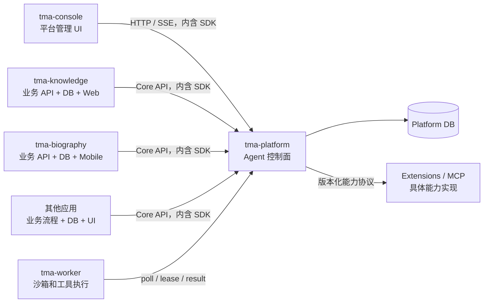

# TMA Platform 边界

本文定义 `tma-platform` 的长期架构边界，并作为新功能设计、代码评审和仓库拆分的判断标准。
应用开发、运行资源发布和 Session/Run 接入方式见
[TMA Platform 使用说明书](./platform-guide.md)。

## 核心定位

`tma-platform` 是 TMA 最主要的核心，是通用 Agent Runtime 的控制面：

> Platform 管 Agent 如何被安全、可靠地执行；应用管为什么执行以及执行什么业务。

Platform 不是所有 TMA 产品的公共业务后端，也不应随着应用增加而不断吸收应用的数据模型、
流程、页面和外部集成。

## 最终验收标准

> 删除所有应用后，Platform 仍能独立完成 Agent 创建、Session/Run 执行、Worker 调度、
> 事件输出和权限治理；新增一种应用时，不需要修改 Platform 代码或增加 Platform 数据库迁移。

任何新能力如果不能满足这个标准，默认应由应用、Worker Runtime 或 Extension 实现，
Platform 最多提供通用契约和治理能力。

## Platform 拥有的能力

| 领域 | Platform 职责 |
| --- | --- |
| 租户与安全 | Organization、Workspace、成员关系、平台角色、RBAC、服务身份和 Scope |
| Agent 定义 | Agent、不可变配置版本、Environment、模型绑定、Skill/MCP 绑定 |
| 执行状态 | Session、Turn、Run、Event、状态机、重试、取消和恢复 |
| 人机协作 | Approval、Intervention、Plan、Budget 和权限判定 |
| Worker 控制面 | 注册、队列、Lease、Heartbeat、结果回写和协议兼容 |
| 通用能力治理 | Capability Schema、Tool Policy、MCP Registry 和 Skill Registry |
| 模型运行与治理 | 文本生成、Embedding、Rerank、ASR、TTS、Realtime Speech 的模型契约、路由、额度和用量记录 |
| 通用资源 | Artifact/ObjectRef 元数据、生命周期和关联关系 |
| 检索运行时 | Retrieval Collection、Document、Chunk、摄取任务、解析、切块、索引、检索和引用 |
| 平台运营 | Schedule、Trace、Audit、Metrics 和通用 Evaluation |

Platform 可以提供上述资源的管理 API。管理这些资源的 `tma-console` UI 不属于 Platform
服务端实现；UI 通过公开 API 和 TypeScript SDK 调用 Platform。

## Platform 只拥有契约的能力

| 能力 | Platform 保留 | 具体实现归属 |
| --- | --- | --- |
| Worker | 队列、租约和 Worker Protocol 服务端 | Platform 仓库内的 `tma-worker` 执行单元 |
| Tool/Capability | Schema、权限、绑定和调用记录 | Worker、Extension 或应用 |
| MCP | 注册、版本、绑定和策略 | 具体 MCP Server |
| Model Runtime | Generate、Embedding、Rerank、ASR、TTS 和实时语音接口、配置、路由、配额和用量 | Provider Adapter |
| Object Store | ObjectRef、生命周期接口和访问策略 | S3、MinIO 等基础设施 Adapter |
| Retrieval Runtime | Collection/Document/Chunk 契约、摄取编排、索引、Search/Citation、Workspace ACL | Parser、Embedding、Rerank 和向量/全文索引 Adapter |
| 应用集成 | Event、Webhook、SDK 和服务身份契约 | 应用消费者和应用网关 |

具体 Provider 或 Adapter 可以随 Platform 发行，但必须位于基础设施适配层，不能进入
Platform 的领域模型，也不能让核心状态机依赖某个厂商或应用。

## 应用拥有的能力

`tma-knowledge`、`tma-biography`、`tma-r-survival-workbench` 以及未来应用必须独立拥有：

- 应用业务表、业务状态机和数据库迁移；
- 产品专属 Prompt、Agent 模板和 Skill 源码；
- 业务 API、UI、网关和部署生命周期；
- 领域专属外部集成、运行镜像和对象存储空间；
- 领域权限和审计记录，但不能绕过 Platform 的 Workspace 与执行权限。

应用在 Platform 注册的 Agent、Skill 和运行配置只是运行时投影，权威定义仍属于应用仓库。
Platform 可以保存 `external_ref`、`correlation_id` 和 labels 等不透明关联信息，但不能建立
指向应用业务表的数据库外键，也不能直接查询或更新应用数据库。

Platform 不应该认识 `BiographyChapter`、`KnowledgeService`、`KnowledgeShare`、
`RSurvivalProject` 等领域对象。它可以认识领域中性的 `RetrievalCollection`、
`RetrievalDocument` 和 `RetrievalChunk`，但这些对象不能包含问答场景、产品 Prompt、敏感词、
公开分享或 Knowledge 产品状态。除检索运行时外，Platform 只需要认识 Workspace、Agent、
Session、Run、Event、ArtifactRef 和 CapabilityRef 等通用运行资源。

## 依赖规则

必须遵守以下依赖约束：

1. Platform 永远不能 import 应用源码，也不能直接访问应用数据库。
2. 应用通过公开 Core API、事件和 SDK 使用 Platform，不 import Platform `internal` 包。
3. Worker 通过版本化协议连接 Platform，不直连 Platform PostgreSQL。
4. API Gateway 可以统一域名和路由，但不能形成 Platform 对应用的源码或数据依赖。
5. `tma-platform` 同仓 Core SDK 只包含 Core API、事件 Schema 和客户端；Worker Protocol
   使用独立协议包。应用 API 应由应用自己发布客户端，不能进入 Core SDK。
6. 跨服务只传稳定 ID、版本化 DTO 和事件，不共享 Store 实现或数据库事务。

## 当前需要收回的越界实现

以下能力目前仍在 Platform Server 内，后续应按拆分计划迁出：

- R 生存分析 Project、任务模板和 GitLab Provisioner；
- R Notebook Docker Runtime 和生存分析应用专属执行流程；
- Knowledge Service、Share、问答策略、公开访问和产品审计；
- 现有 Knowledge Base、Document、Chunk、上传和检索实现中的通用部分不迁出，而是重命名并
  收敛为 Platform Retrieval Runtime；
- 对话工作台、Inspector、Console、Space、Knowledge 的嵌入式 Web 静态资源；
- 浏览器、OnlyBoxes 等具体能力 Provider，迁入 Worker Runtime 或 Extensions。

Workspace Membership、Platform Role Assignment 和 Workspace 管理属于 Platform 核心，
即使当前代码或迁移名称中包含 `console`，也不应随 Console UI 一起迁出。相反，应逐步将
`console` 命名的服务端 Handler/API 改为面向资源或身份语义的通用命名。

## 新功能准入检查

设计新功能时依次回答：

1. 去掉具体产品名称后，它是否仍是所有 Agent 应用都需要的运行或治理概念？
2. 它是否必须参与 Platform 的执行一致性、权限判定或恢复语义？
3. 新增第二种同类应用时，现有数据模型是否无需变化？
4. 它能否只通过 API、Event、Worker Protocol、MCP 或 Capability Contract 实现？

前三项不能明确回答“是”，或者第四项可以回答“是”时，默认不进入 Platform 核心。

模型能力按“通用模型能力”判断，不按首个使用它的应用判断。ASR、TTS 和 Realtime Speech
可以被会议、客服、教育、内容创作等多个应用复用，因此属于 Platform Model Runtime；具体
语音供应商由 Provider Adapter 实现。应用只保留业务会话编排、录音领域数据、声音/情绪选择
和产品交互，不直接持有共享模型供应商的密钥和调用治理。

这里的 Platform 是产品和公共契约边界，不要求所有音频数据都经过 `tma-server` 单体进程。
`tma-server` 负责认证、模型注册、策略、路由、配额、用量和审计；高吞吐 Model/Speech Runtime
数据面可以独立部署和扩缩容。应用仍只依赖 Platform 发布的稳定 API/SDK，不直接依赖供应商协议。

检索能力采用同一判断标准。文档解析、切块、Embedding、Rerank、索引、Search 和 Citation 可被
知识问答、项目资料搜索、个人档案检索和客服等应用复用，因此属于 Platform Retrieval Runtime。
具体问答场景、拒答规则、公开分享和运营记录只服务 Knowledge 产品，继续属于
`tma-knowledge`。新增文件格式或索引后端通过 Parser/Index Adapter 扩展，不能把应用模型带入
Platform。
