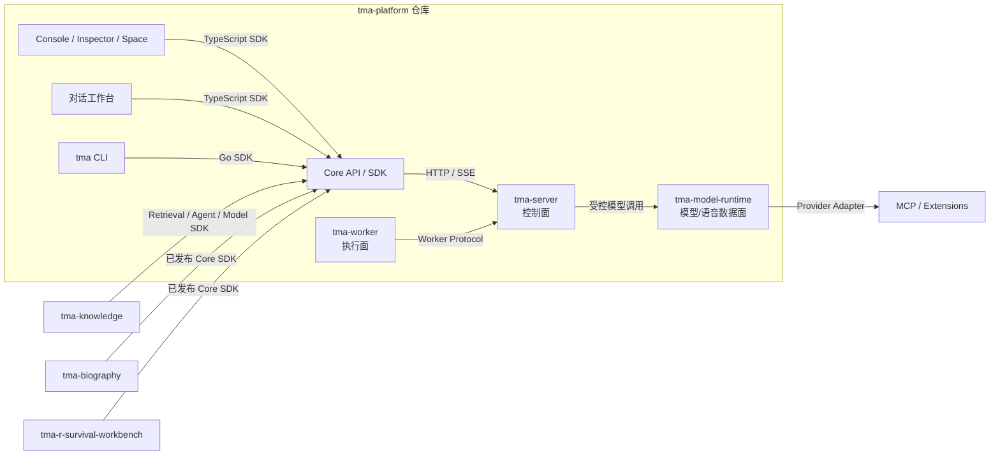

# TMA Platform 最终整改方案

本文是 Platform 边界整改和仓库拆分的执行方案。架构判断以
[platform-boundary.md](./platform-boundary.md) 为准，应用接入方式以
[platform-guide.md](./platform-guide.md) 为准。整改必须按本方案的阶段门槛推进，不以单纯移动
目录或创建 Git 仓库视为完成。

## 最终目标

整改完成后：

> 删除所有应用后，Platform 仍能独立完成 Agent 创建、Session/Run 执行、模型调用、Worker
> 调度、事件输出和权限治理；新增应用不需要修改 Platform 源码或增加 Platform 业务迁移。

应用只能通过已发布的 API、SDK、Event、Worker Protocol、MCP 或 Capability Contract 使用
Platform。Platform 不能 import 应用源码，不能访问应用数据库，也不托管应用业务页面。

## 最终项目划分

| 项目 | 最终职责 | 发布单元 |
| --- | --- | --- |
| `tma-platform` | Agent 控制面、Model/Speech Runtime、Retrieval Runtime、Worker Runtime、Core API/SDK、CLI、对话工作台、Console、身份/RBAC、通用治理和 Platform 数据库 | `tma-server`、`tma-model-runtime`、`tma-worker`、Core SDK 包、`tma` CLI、对话工作台、Console Web、迁移包 |
| `tma-knowledge` | Knowledge Service、产品问答策略、敏感词/拒答、Web fallback、分享、问题审计和 Knowledge Web | Knowledge API、迁移、Web |
| `tma-biography` | 移动端、采访网关、录音、章节和 Biography Agent 声明 | Mobile、Voice Gateway、迁移 |
| `tma-r-survival-workbench` | R 生存分析 Project、数据集、GitLab、Notebook、R Runtime、数据清洗/分析流程和专业 UI | R Survival API、Web、R Runtime、专属 Capability |

泛化的 `tma-workbench` 仓库和“扩展工作台”产品概念取消。`apps/workbench` 的对话核心归
`tma-platform`，R 生存分析领域能力归 `tma-r-survival-workbench`。

通用浏览器、OnlyBoxes 和示例 Provider 暂时放在 `tma-platform/extensions` 并保持独立发布单元。
具体 R Notebook 和生存分析能力由 `tma-r-survival-workbench` 拥有，可以通过
Worker/Capability Protocol 执行。对话工作台是 Platform 官方客户端，不拥有这些业务对象。

`tma-model-runtime` 首期放在 `tma-platform` 仓库，逻辑上属于 Platform 数据面，部署上可以独立
扩缩容。只有发布频率、团队所有权或容量模型明显独立后，才考虑再拆仓库。

Core SDK 和 CLI 同样位于 `tma-platform` 仓库，但仍独立发布包和可执行文件。CLI 是 Platform
官方客户端，不是独立服务；它只能通过 Core SDK/公开协议使用 Platform，不能调用 Server
`internal` 包。应用仓库只依赖已发布 SDK 版本，不能通过相对路径读取 Platform 源码。

## 最终依赖关系



图中的 Core SDK 是编译进调用方的库，不是运行时服务。SDK、CLI、Console、Worker 与 Server
虽然同仓，仍使用版本化公开契约。生产 API Gateway 可以提供统一域名，但路由聚合不能形成
Platform 对应用的源码或数据库依赖。

## 最终所有权规则

### Agent、Skill 和 MCP

| 对象 | Platform 拥有 | 应用拥有 |
| --- | --- | --- |
| Agent | ID、配置版本、模型/Skill/MCP 绑定、权限和运行记录 | 应用专属 Prompt、声明源文件和业务含义 |
| Skill | Registry、发布版本、包、启停、绑定、策略和使用记录 | `SKILL.md`、资源文件和应用专属内容 |
| MCP | Server 注册、配置版本、Workspace 绑定、权限和健康状态 | MCP Server 实现、业务授权和数据访问 |

应用发布的定义是 Platform 中的运行时投影，应用仓库中的声明是期望状态和源代码。用户直接在
Platform 创建的个人 Agent/Skill 则以 Platform 版本为事实源。

### 模型和语音

Platform 对外提供统一 Model Runtime：

- Generate/Chat；
- Embedding；
- Rerank；
- ASR；
- TTS；
- Realtime Speech/Multimodal Stream。

`tma-server` 负责身份、模型注册、能力发现、路由、策略、配额、用量和审计；
`tma-model-runtime` 负责高吞吐请求、流式协议和 Provider Adapter。Biography 负责采访编排、
录音领域数据、声音/情绪选择和业务进度，不直接连接豆包等共享 Provider。

### 检索

Platform 对外提供领域中性的 Retrieval Runtime：Collection、Document/Chunk、摄取任务、通用
PDF/DOCX/HTML/CSV/JSON 解析、切块、Embedding/Rerank、索引/重建/删除、Search 和 Citation。
Platform 负责 Workspace ACL、Artifact/ObjectRef 关联以及 `retrieval.search` Capability；解析器、
模型和索引后端通过 Adapter 扩展。

Knowledge 只组合这些能力形成具体产品，拥有 Service、场景 Prompt、敏感词/拒答、Web fallback、
公开 Share 和 Question Audit。Platform Retrieval 模型不得出现这些产品字段。

### 数据

| 数据库所有者 | 数据 |
| --- | --- |
| Platform | Workspace、Agent、Skill、MCP、Environment、Session、Run、Event、Worker、Artifact、Trace、Evaluation、Model 配置和用量，以及 Retrieval Collection、Document、Chunk、摄取任务和索引元数据 |
| Knowledge | Service、Collection/Document ID 选择、产品策略、Share、Question Audit |
| Biography | Project、Chapter、Recording、Segment、采访进度 |
| R语言生存分析工作台 | R Survival Project、Dataset、Repository、Notebook/Runtime 绑定和分析任务 |

跨项目只能保存不透明 ID 和 namespaced metadata，不能创建跨数据库外键或共享事务。

## 阶段 0：冻结新增越界

目标：在迁移期间阻止架构继续恶化，不改变运行行为。

实施项：

1. 为 Platform 内部 Server、Model Runtime、Worker、SDK、CLI、对话工作台、Console，以及外部
   Knowledge、R语言生存分析工作台建立目录/包所有权清单。
2. CI 检查 `cmd/tma-server` 依赖图，禁止新增应用包和应用 Web Asset。
3. CI 检查 Platform SQL，禁止新增 `knowledge_service*`、`biography_*`、`workbench_*`、
   `r_survival_*` 等应用表；
   通用检索表只能使用 `retrieval_*` 命名。
4. 新 API 必须先判断是 Core API、Application API 还是 Provider Protocol。
5. 建立现有越界 allowlist；只允许减少，不允许增加。

完成门槛：边界检查进入必过 CI，现有构建和测试行为不变。

当前进度：Platform 已维护显式兼容债务 allowlist，`tma-server` 的应用依赖、兼容路由和应用表
只允许减少，新增项会使 CI 失败；Knowledge、Biography 和 R语言生存分析工作台各自拥有仓库
边界检查。

## 阶段 1：稳定 Core Contract

目标：先形成可独立消费的契约，再迁移应用实现。

实施项：

1. 从 `api/v2/openapi.yaml` 移出 Knowledge Service/Share/Question 和 R 生存分析 Project API；将现有
   Knowledge Base/Document/Search 契约泛化为 `/v2/retrieval/*` Core API。
2. `tma-platform/sdk` 只生成 Core API 和 Event 客户端；Worker/Capability Protocol 使用同仓的
   独立协议包，不能混入应用 API。
3. 已增加正式 Application/Service Identity、最小 Scope、可轮换凭据和审计主体；Knowledge 与
   Biography 已要求使用各自的 Service Credential，生产凭据仍只在切流阶段签发。
4. 已增加短期 On-behalf-of Token Exchange：绑定用户、Workspace、应用/凭据和 Scope，禁止委托链并支持撤销立即失效；
   Knowledge 的 Retrieval/Model 调用与 Biography 的 Session/Speech 调用已按操作交换短期用户委托 Token。
5. 已为 Agent、Environment、Skill、MCP、Session 增加通用 `app_id`、`external_ref`、受限 labels、
   应用凭据强制归属和按应用查询。
6. 已提供 Declarative Application Manifest 和 Go/TypeScript SDK，按依赖顺序幂等调和 Agent、Skill、
   MCP 和默认 Environment，返回 `created`、`updated`、`unchanged`。
7. 已将 Run 提升为一等持久化实体，明确 `Session -> Turn -> Run -> Attempt/Event`；每次 Worker
   claim、租约恢复、挂起和终止均保存独立 Attempt，Event 可直接关联 Run/Attempt。
8. 已定义可靠 Event Subscription/Webhook，使用事务性 Outbox、幂等 delivery ID、HMAC 签名、
   指数退避、死信和 replay。
9. 已提供 `GET /v2/capabilities` Capability Discovery 和 Go/TypeScript SDK；按 Workspace 聚合
   Model/Speech 路由、Retrieval、Artifact、Event Subscription 与 Worker 能力，不返回 Provider
   secret 或内部凭证。
10. 已将现有加密 Environment Variable 收敛为 App-scoped Secret Reference：Application Identity
    通过 `secrets:read` / `secrets:write` 管理自己的密钥，API 只返回元数据；Session Runtime 按
    `app_id` 解析应用记录并通过加密信封传递给 Worker，同名应用值优先于用户/Workspace 变量。

兼容策略：旧 v2 路径保留代理或 deprecated alias；SDK 先支持新契约，再迁移应用。

完成门槛：一个最小示例应用只使用已发布 SDK 即可发布 Agent/Skill、创建 Session/Run 并在重启后
恢复结果，不 import Platform 源码。

当前进度：Resource Ownership、Declarative Application Manifest、Reliable Event Subscription/Webhook
与 First-class Run Persistence 已进入 Core OpenAPI、Go/TypeScript SDK 和 PostgreSQL 集成门禁。
Knowledge 和 Biography 已固定消费
`v0.1.0-alpha.6` Core SDK 快照并通过独立仓库 CI；
用户触发的 Platform 调用使用 OBO，公开分享等无用户后台路径使用 Service Credential。R语言生存
分析工作台当前只调用 `/v2/auth/me` 建立本地应用权限边界，尚无 Platform Core 业务调用，因此不
为形式接入增加无用途的 Service Credential；未来新增 Agent、Run、Artifact 或 Model 调用时再按
同一规则接入。

## 阶段 2：建设 Model/Speech Runtime

目标：把当前仅供 Server 内部使用的模型实现变成应用可依赖的通用 Platform 能力。

实施项：

1. 定义 Generate、Embedding、Rerank、ASR、TTS 和 Realtime Speech 的 OpenAPI/流式协议。
2. 扩展 Model Registry 的 capability、输入输出格式、语言、voice、流式和批处理描述。
3. 建立 `tma-model-runtime` 数据面和 Provider Adapter 接口。
4. `tma-server` 负责授权、路由、短期调用凭证、Quota、Usage、Trace 和 Audit。
5. 音频默认不持久化；只有调用方明确创建 Artifact 时才进入受控对象存储。
6. Biography 生产路径已改成 Platform Speech SDK/API，旧厂商直连实现和凭据配置已经删除；
   Provider 协议、Endpoint、Resource ID 和 API Key 只存在于 Platform Adapter 与模型目录。
7. Retrieval Runtime 通过 Model Runtime 使用 Embedding/Rerank；Knowledge 回答生成优先使用
   Knowledge Agent + `retrieval.search` Capability。

当前进度：Generate、Embedding、Rerank、Realtime ASR/TTS、Go/TypeScript SDK 和 Biography SDK
接入已完成，Biography 厂商直连已经删除。Generate Phase 1 已支持兼容纯文本的结构化图片输入、
公共 HTTPS/data URL 校验、输入大小限制、`text_image` capability gate 和 Invocation 指标；视频、
音视频实时混合流的 Phase 2A 已定义版本化 track、媒体帧、ObjectRef 和双向 credit window，并实现
共享编解码、校验和流控状态。Phase 2B 的第一切片已完成 TMA-native WebSocket Provider Adapter、
签名认证的 Server→Runtime 内部路由、双向 credit/sequence/track 校验与取消传播。模型目录 realtime
capability 和 Capability Discovery 也已完成，Server/Runtime 会对输入格式、输出模态、track 数和帧
上限执行双层准入。Server ObjectRef 解析器现已完成 Workspace/Owner/Session Artifact ACL、受限读取
以及客户端、track、数据库、存储元数据和实际内容校验。Invocation recorder 使用独立
`multimodal_realtime` capability 聚合媒体指标、规范化终态、保证单次落库，并复用长会话 admission
和 Workspace/Application Quota。公共路由现已不可绕过地串联用户/Application Scope、目录准入、
Provider Credential、ObjectRef ACL、admission、Runtime proxy 和 Invocation recorder；独立 Runtime
只接收解析后的媒体帧。Go/TypeScript Realtime Core SDK 现已提供兼容帧编解码、credit 等待、
`latest` 丢弃、discontinuity 和有界事件队列。首个真实云厂商协议 Adapter 已选择 OpenAI Realtime：
模型目录只允许 24 kHz 单声道 PCM16、JPEG/PNG 图片帧和文本/音频输出，Runtime 完成 Bearer Header、
厂商事件、TMA 帧及 credit 的双向转换，并已通过本地 WebSocket 契约、慢 Provider、慢客户端、
双向断线和双 Server 共享 Quota Store 测试。下一切片仍需真实 OpenAI 账号和部署环境中的 PostgreSQL
多副本压测。Server→Runtime 内部路由不进入 Core OpenAPI。
Embedding 支持 OpenAI/TEI/Ollama 协议，Rerank 支持
Jina/Cohere/vLLM 协议，并强制执行模型目录中的维度、批量和候选数约束。直接 Model/Speech 调用
已经写入独立、租户隔离的 `model_invocations` Usage/Audit 记录，并通过 Workspace 管理员查询 API
读取；不会伪造 Session/Turn。Application/Service Identity 已提供强制 RLS 的身份/凭据模型、
一次性凭据返回、哈希存储、撤销、最小 Scope 和默认拒绝授权，并将 `service_identity_id` 写入
Invocation 审计。Model/Speech 入口现已执行 Workspace、Identity 和 Provider/Model Route 四级
单副本并发保护；PostgreSQL 原子分钟桶按 Workspace、Service Identity/Principal、Capability、
Provider 和 Model 跨副本执行请求配额；Speech 另有最大会话时长。超限会返回稳定错误和
`Retry-After`/WebSocket 重试字段，并写入 Invocation 审计。公开同步 Generate、Embedding、Rerank、
Agent Turn 流式 Generate 和 Realtime ASR/TTS 已提取为不连接 Platform 数据库的
`tma-model-runtime` 独立发布单元；Server 可通过受保护、支持取消传播的内部 HTTP/NDJSON/WebSocket
协议调用，并保留进程内开发模式。内部链路现已支持生产强制的原生 mTLS 或 Service Mesh、逐请求
短期签名凭证，以及 NDJSON/WebSocket 活跃流、事件和背压指标。可管理的 Workspace 套餐、
Application Identity 覆盖、版本化策略 API、跨副本分钟执行和月度预算告警也已完成，阶段 2 关闭。

## 阶段 3：拆分 Retrieval Runtime 与 Knowledge

目标：通用检索成为稳定 Platform 能力，Knowledge 成为独立的产品服务。

现有文件是混合边界，不能整文件迁出。先拆分：

```text
Platform Retrieval Runtime:
  knowledge_service.go 中 Base/Document、文件提取、切块、Embedding、Search 部分
  /v2/knowledge/bases* -> /v2/retrieval/collections*
  /v2/knowledge/documents* -> /v2/retrieval/documents*
  新增 /v2/retrieval/ingestion-jobs/* 和 /v2/retrieval/search

tma-knowledge:
  apps/knowledge
  knowledge_service.go 中 Service/Share/Question、Prompt、拒答和 Web fallback 部分
  /v2/knowledge/services/*
  /v2/public/knowledge-shares/*
  000098_knowledge_share_history.sql
  000099_knowledge_service_documents.sql
```

整改：

1. 在 Platform 建立独立 `retrieval` Handler、Store 和 Core SDK Service，不沿用 Knowledge 产品类型。
2. 将 `knowledge_bases`、`knowledge_documents`、`knowledge_chunks` 分别迁移/重命名为
   `retrieval_collections`、`retrieval_documents`、`retrieval_chunks`，并新增
   `retrieval_ingestion_jobs`、`retrieval_indexes`；这些表继续由 Platform 迁移包拥有。
3. 建立 `tma-knowledge-server`、独立 Store、迁移包、Schema/数据库角色和应用对象存储空间；迁入
   `knowledge_services`、`knowledge_service_shares`、`knowledge_service_questions`。
   `000098`、`000099` 继续属于 Knowledge 应用迁移。
4. 将 Service 中的 `knowledge_base_ids`、`knowledge_document_ids` 逐步改名为
   `retrieval_collection_ids`、`retrieval_document_ids`。它们是普通字符串数组；Knowledge 通过
   Core SDK 调用 Retrieval，不得创建指向 Platform 表的外键，也不得直接调用 Platform
   `internal/llm`、`internal/objectstore` 或 Store。
5. Knowledge 通过 Agent/Run 完成回答生成；Agent 使用 `retrieval.search` 获取带 Citation 的结果。
6. API Gateway 将产品路径转发到 Knowledge；旧 Base/Document 路径在兼容期代理到 Retrieval API。
7. 先切读流量并校验检索结果，再切写流量；旧表只读保留到回滚窗口结束后再单独清理。

完成门槛：停止 Knowledge 服务不影响 Retrieval API；Platform 数据库只存在 `retrieval_*`，不存在
`knowledge_service*`；Knowledge 数据库不存在 Collection/Document/Chunk 副本；Knowledge 可独立
迁移、构建、部署和回滚，且其他应用可不依赖 Knowledge 直接使用 Core SDK 完成摄取和检索。

## 阶段 4：独立 R语言生存分析工作台，收敛对话工作台与 Console

### R语言生存分析工作台

迁入 `tma-r-survival-workbench`：

```text
apps/workbench/src/plugins/analysisWorkbench
internal/workbenchprojects
internal/workbenchruntime
/v1|v2/workbench-projects/*
/v1|v2/task-templates
000093_workbench_projects.sql
000094_workbench_project_runtime.sql
GitLab Provisioner
R Notebook Runtime
R 生存分析 Skill、数据清洗流程和专业 UI
```

目标应用 API 改用领域命名 `/v2/r-survival-projects/*`，旧 `/v2/workbench-projects/*` 只保留兼容期。
R语言生存分析工作台通过 Core SDK 创建 Agent/Session/Run，通过 Artifact 交换文件，通过
Worker/Capability 执行 Notebook。Platform 不保存 Project、Dataset、Repository 或 Notebook 状态。

当前进度：独立仓库已拥有领域 API、Web、迁移、GitLab/Notebook Provisioner 和 R Runtime 镜像；
对话工作台的“扩展工作台”入口及静态插件已经删除，Core OpenAPI/SDK 已移除 Workbench Project
契约。R Survival API 已通过 Platform `/v2/auth/me` 验证 Bearer Token，Workspace/Owner 完全来自
认证主体，并禁止 CORS 通配符和持久化 Notebook Token。Platform 中旧 Handler、Store 和
000093/000094 表仅为切流回滚保留，尚未达到删除条件。

### 对话工作台

`apps/workbench` 中 Session/Run、对话、计划、审批、Artifact 和设置页面保留在 `tma-platform`，
产品名称固定为“对话工作台”。删除顶部“扩展工作台”入口和通用工作台目录；完整领域应用不再
作为对话工作台插件发布。前端扩展机制只保留轻量面板、预览器、命令和设置贡献，不能拥有独立
业务后端、数据库或 Runtime。

迁移期必须先让独立 R 应用达到功能等价，再删除 `com.tma.r-survival-workbench` 静态插件及其
对话工作台路由，避免项目入口中断。

### Console

`tma-console` 只保留 Platform 管理 UI、Inspector 和 Space。Platform 保留 Workspace Membership、
Platform Role、Trace 和 Evaluation API，但移除嵌入式静态资源。

将 `/v2/console/context` 替换为通用 `/v2/me` 或 `/v2/auth/context`，旧路径保留兼容期。

完成门槛：Platform Server 镜像不包含 Node 构建产物和 R 生存分析 Handler/Provider；对话工作台、
Console 可以分别使用 Core SDK 部署到静态站点/CDN；R语言生存分析工作台可独立构建、部署、迁移
和回滚。

## 阶段 5：收紧 Platform 仓库内部边界

1. Core OpenAPI、Go/TypeScript SDK、Server Contract Test 在同一 PR 原子生成和验证。
2. Core SDK 独立发布语义版本；外部应用锁定已发布版本，不使用工作区相对路径。
3. 清除 CLI 对 `internal/tools`、`internal/observability`、`internal/serverconfig` 的直接依赖，
   所有命令改用 Go Core SDK 或 CLI 自有展示类型。
4. 固化 Worker Protocol 契约测试；Worker 不 import Server Store，也不访问 Platform 数据库。
5. Console 和对话工作台只使用 TypeScript Core SDK，不直接调用未进入 OpenAPI 的 Handler。
6. 为 Server、Model Runtime、Worker、CLI、SDK、对话工作台和 Console 建立独立构建、测试和
   发布流水线。
7. 浏览器、OnlyBoxes 和通用 Provider 保留在 `tma-platform/extensions`；应用专属 Provider
   跟随应用。

完成门槛：`tma-platform` 是一个多发布单元仓库；各单元可独立构建和部署，依赖方向由 CI 强制，
Knowledge、Biography、R语言生存分析工作台不读取 Platform 仓库源码即可独立测试和发布。

## 阶段 6：清理兼容层

只有在调用指标证明旧路径和旧 SDK 已无使用者后，才能：

1. 删除 v1/旧 v2 alias 和 Gateway 临时代理。
2. 删除 Platform 中的 Knowledge、R 生存分析 Store/Handler/Test 兼容代码，以及对话工作台中的
   “扩展工作台”目录和 R 生存分析静态插件。
3. 删除已经迁移并完成备份保留期的应用表。
4. 删除 Platform 内嵌 Web Assets 和应用构建目标。
5. 收紧 CI allowlist 到零越界。

删除表和兼容 API 必须单独发布，不与数据切换放在同一次部署中。

## 数据迁移与切换规则

每个应用按同一流程切换：

1. 建立目标 Schema、运行角色和迁移流水线。
2. 全量复制并校验行数、关键关联、对象引用和校验和。
3. 短暂冻结业务写入，执行增量复制。
4. 先切 Gateway/服务流量，不立即删除旧表。
5. 观察错误率、延迟、事件积压和数据差异。
6. 在回滚窗口结束后将旧表只读并归档。
7. 最后单独执行删除迁移。

不使用跨服务双写作为长期方案。确需过渡时使用 Outbox、幂等消费和可重放事件。

## 目标 Platform Schema

Platform 保留以下领域的表：

- Organization、Workspace、Membership、Platform Role；
- Agent、Config Version、Environment、Secret Reference；
- Skill、Skill Version、MCP Registry、Capability Policy；
- Session、Turn、Run、Attempt、Event、Plan、Intervention、Schedule；
- Worker、Work Queue、Lease；
- Model Registry、Usage、Quota；
- ObjectRef、Artifact、Lifecycle；
- Retrieval Collection、Document、Chunk、Ingestion Job、Index；
- Trace、Audit、Evaluation、Event Subscription。

当前 `knowledge_services`、`knowledge_service_shares`、`knowledge_service_questions` 和 R 生存分析
Project/Runtime 表迁出；前三个通用 Knowledge 表迁移为 `retrieval_*` 后保留。
`achievement_library_items` 如果继续表示通用 Workspace Artifact Catalog，应改成领域中性的名称；
如果保留 R 生存分析语义，则随 R语言生存分析工作台迁出。

## CI 和验收门槛

### Platform

- `go list -deps ./cmd/tma-server` 不包含 Knowledge、R 生存分析、对话工作台/Console Web 或具体应用包。
- Platform SQL 不包含应用业务表，只允许领域中性的 `retrieval_*` 检索表。
- Platform 镜像不包含应用静态资源。
- Core OpenAPI 包含 `/v2/retrieval/*`，不包含 `/knowledge/services`、
  `/public/knowledge-shares`、`/r-survival-projects`、`/workbench-projects` 等应用路径。
- Go/TypeScript Core SDK 覆盖 Collection、Document、Ingestion Job 和 Search/Citation。
- Model/Speech Provider 可以替换且不改变应用契约。

当前契约状态：Core OpenAPI 和生成的 Go/TypeScript SDK 已包含 `/v2/retrieval/*` 与 Speech Core
契约，并已移除 Knowledge、公开分享和 Workbench Project 等应用 Schema/路径。Platform Server 中
对应的旧 Handler 与旧表仍是迁移期兼容层；只有完成数据复制、差异校验、Gateway 切流和回滚窗口
后才能在独立发布中删除。

### 应用

- 只依赖已发布 Core SDK/API，不使用相对路径读取 Platform 源码。
- 使用独立 Schema/数据库角色和迁移包。
- Agent/Skill/MCP 声明可幂等发布并固定版本。
- Run 使用稳定幂等键，进程重启后可以恢复。
- 删除应用不会影响 Platform 健康检查和启动。

### 跨项目

```bash
make test-platform
make test-model-runtime
make test-worker
make test-console
make test-knowledge
make test-biography
make test-chat-workbench
make test-r-survival-workbench
make test-sdk
make test-cli
```

Platform 相关命令在 `tma-platform` 仓库分别执行，三类应用命令在各自仓库执行。端到端测试通过
已发布 SDK、协议和容器镜像组装环境。

## 执行顺序

严格按以下顺序推进：

1. 边界 CI 和现状基线；
2. Core Contract、应用身份、资源所有权和 Run/Event 契约；
3. Model/Speech Runtime，并迁移 Biography 语音；
4. 收敛 Retrieval Runtime，并完成 Knowledge 独立服务和产品数据切换；
5. 独立 R语言生存分析工作台，并从对话工作台删除“扩展工作台”产品入口；
6. Console 静态资源独立部署；
7. 收紧 Platform 内部 SDK、CLI、Worker、Console 和 Extension 的发布边界；
8. 删除兼容代码和旧表。

不能为了加快架构整改跳过契约、数据所有权和独立部署验证。
