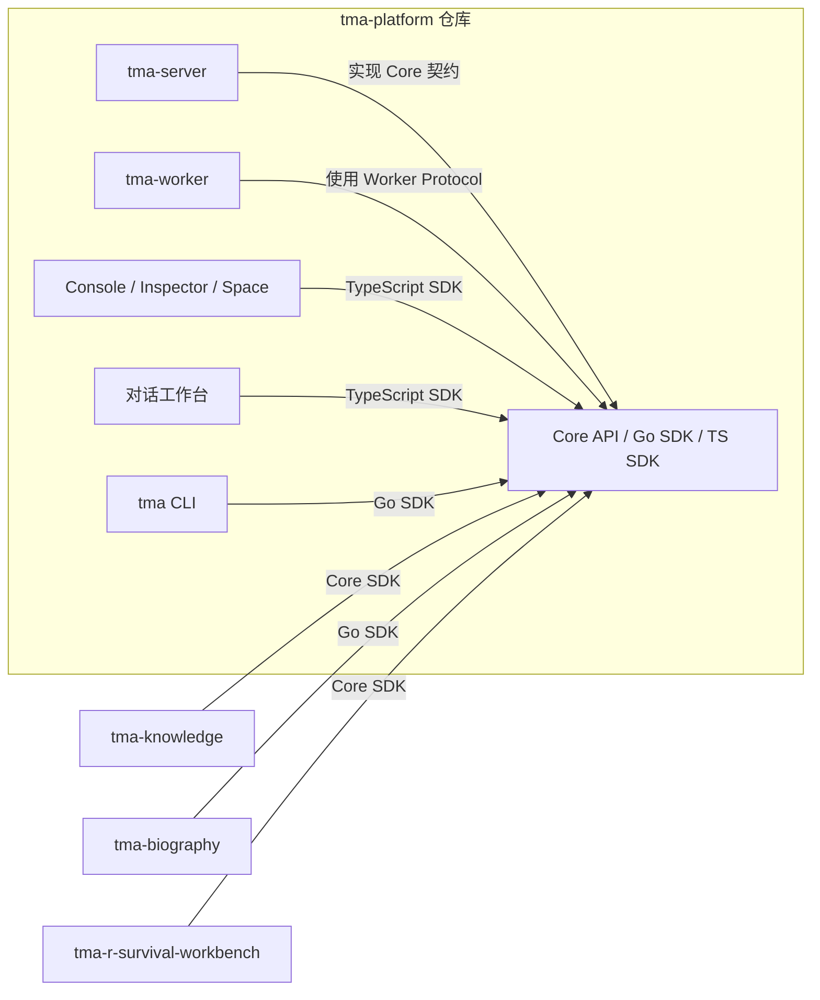
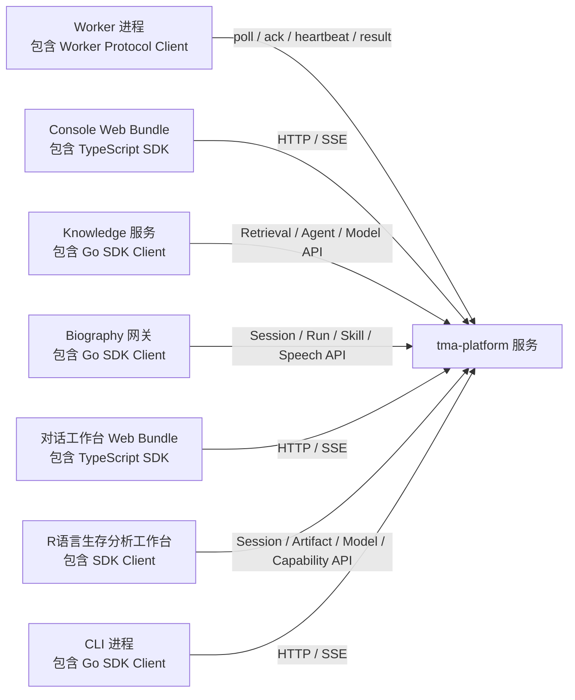

# 仓库拆分方案

拆分工作开始前，本仓库同时承载控制面、执行面、多个 Web 产品、SDK 和自传业务。
Biography、Knowledge 和 R语言生存分析工作台已经建立独立目标仓库；Platform 中仍保留部分
兼容 API、数据和静态资源用于数据/流量切换。本文件定义目标仓库、
暂时保留的边界以及迁移顺序。

`tma-platform` 的长期职责、应用集成约束和新功能准入标准见
[TMA Platform 边界](platform-boundary.md)。仓库拆分和后续功能设计均以该文档为准。
最终整改批次、数据切换步骤和验收门槛见
[TMA Platform 最终整改方案](platform-remediation-plan.md)。

## 目标仓库

| 仓库 | 负责内容 | 发布单元 | 依赖方向 |
| --- | --- | --- | --- |
| `tma-platform` | `tma-server`、Model/Speech Runtime、Retrieval Runtime、Worker Runtime、Core API/SDK、CLI、对话工作台、Console/Inspector/Space、Platform Schema | Server/Model/Worker 镜像、SDK 包、`tma` CLI、Web、迁移包 | 仓库内部只通过版本化 Core/Worker/Model 契约依赖 |
| `tma-knowledge` | Knowledge Service、场景问答策略、敏感词/拒答、Web fallback、公开分享、问题审计和 Knowledge Web | Knowledge API + Web 静态资源 | 通过 Core SDK 依赖 Retrieval、Agent/Run、Model 和 Artifact |
| `tma-biography` | 自传移动端、语音网关、自传 Agent bootstrap、录音和章节业务 | 移动端 + `tma-biography-voice-gateway` | 通过 SDK/API 依赖平台，不依赖平台 `internal` 包 |
| `tma-r-survival-workbench` | R 生存分析 Project、数据集、GitLab、Notebook、R Runtime、数据清洗/分析流程和专业 Web | R Survival API + Web + R Runtime/专属 Capability | 依赖 Core SDK、Artifact、Model 和 Worker/Capability Protocol |

不再建立泛化的 `tma-workbench` 仓库。“对话工作台”特指 `tma-platform` 中以 Session/Run 对话为
核心的官方客户端；“R语言生存分析工作台”特指独立领域应用，两者不能共用 Workbench 业务模型。

通用浏览器网关、OnlyBoxes 和示例插件暂时放在 `tma-platform/extensions` 并独立发布；只有在
团队所有权或发布频率明显独立后再建立独立仓库。

## 模块依赖关系

Core SDK 位于 `tma-platform` 仓库，是被编译或打包进调用方的代码，不是独立运行的服务。源码依赖和运行时网络
调用需要分开看；下面两张图中的箭头都从调用方指向被依赖方。

构建期依赖：



运行时调用：SDK 已经包含在各自进程或 Web Bundle 内，真正跨网络的是这些进程与服务。



同仓 Core SDK 只包含 Core 契约、生成类型和客户端；Worker/Capability 使用独立协议包。它们都不
包含应用 API、数据库访问或服务端业务实现。
Platform 实现 Core API 并同仓发布对话工作台；Knowledge 拥有自己的 API 和前端；Biography
拥有移动端和语音网关；R语言生存分析工作台拥有自己的业务 API 和 Web。生产入口的 API
Gateway 可以把应用路径路由到相应服务，但这不形成 Platform 对应用的源码依赖。

| 项目 | 数据所有权 |
| --- | --- |
| `tma-platform` | Workspace、Agent、Environment、Session、Turn、Run、Event、Worker、Skill、MCP、Model、Trace、Artifact、Retrieval Collection/Document/Chunk、摄取任务、索引元数据和用量 |
| `tma-knowledge` | Knowledge Service、Collection/Document ID 选择、产品策略、Share、Question Audit 和应用专属对象 |
| `tma-biography` | 自传项目、章节、录音、录音分段、采访进度和独立对象存储前缀/桶 |
| `tma-r-survival-workbench` | R Survival Project、Dataset、Repository、Notebook/Runtime 绑定、分析任务和专属对象 |
| Platform Worker Runtime | 临时执行状态和受限本地 Workspace；不拥有平台业务数据库 |
| Platform Console、CLI | 仅客户端状态和凭据；不直接访问任何服务数据库 |
| Platform Core SDK | 无运行时数据 |

跨项目不能直接查询或更新对方的数据表。需要联动时使用 API、事件或版本化协议；即使
多个服务暂时部署在同一个 PostgreSQL 实例，也要使用独立 Schema、运行角色和迁移所有权。

## 当前目录映射

当前目标实现与兼容实现并存：

```text
platform:  cmd/{tma-server,tma-worker,tma}, apps/{console,inspector,space},
           apps/workbench 对话工作台（已删除 R 生存分析静态插件），
           api/v2, sdk/{tma,typescript},
           internal/{agent*,httpapi,managedagents,runner,capability,execution,
                     tools,workruntime,workerselect,...},
           从 knowledge_service Handler/Store 中拆出的 retrieval 实现，
           000097 中重命名后的 retrieval_* 表及其他 Platform Schema
r-survival-workbench:
           ../tma-r-survival-workbench 已独立拥有 R Survival API、专业 Web、
           GitLab/Notebook Provisioner、R Runtime 镜像、应用迁移和分析模板；
           Platform 中 internal/{workbenchprojects,workbenchruntime}、
           /v2/workbench-projects/* Handler 和 000093/000094 旧表暂作兼容层，
           数据与流量核对完成后删除
knowledge: ../tma-knowledge 已独立拥有 Knowledge API、Web、应用 OpenAPI、
           knowledge_services/share/question 数据库迁移、Platform 数据复制工具、
           产品 Prompt、敏感词/拒答、SearxNG fallback 和公开分享；
           Platform 中 apps/knowledge、/v2/knowledge/* 路由和应用表暂作兼容层，
           数据与流量核对完成后删除
biography: 已迁移到独立的 tma-biography 项目；Platform 不再保留其源码、
           业务迁移、移动端、Skills 或镜像构建目标
```

目录映射不是最终的拆分方式。`internal/managedagents`、`internal/objectstore` 等平台包被
多个边界使用，迁移时必须先通过 API、协议或独立公共包替换直接 Go import。

## 必须保持的边界

1. Biography 只能调用公开 HTTP API/SDK。`tma-biography` 不得导入 `internal/httpapi`、
   `internal/managedagents` 或其他平台实现包。
2. Worker 不能直连 PostgreSQL。Worker 与 Platform 之间只使用版本化的 Worker HTTP
   协议和工具/能力 Schema。
3. Console 不复制 OpenAPI 类型。所有 API 类型、SSE 解析和分页契约来自同仓 Core SDK。
4. Platform 拥有领域中性的 Retrieval Collection、Document、Chunk、摄取和检索；Knowledge
   拥有 Service、场景策略、Share 和 Question Audit。Knowledge 只能通过 Core SDK/API 使用
   Retrieval，不能直接读写 Platform 表；双方只保存字符串资源 ID，不建立跨数据库外键。
5. 对话工作台只使用 Core SDK，不拥有 Project、Repository、Notebook 或 R Runtime。R语言生存
   分析工作台独立拥有这些领域对象；Platform 只提供 Agent、Artifact、Model 和
   Worker/Capability 契约。
6. 每个服务拥有自己的业务 Schema 和迁移包。迁移可以由统一部署流程编排，但不能由服务
   启动时隐式执行，也不能跨服务直接修改对方的数据表。
7. Core SDK 的破坏性变更必须先更新契约版本，再更新 Platform、Console、CLI、Knowledge、Biography
   和 R语言生存分析工作台的消费方。
8. CLI 只能通过 Go SDK 或公开 HTTP/事件协议访问 Platform，不能导入 `internal/tools`、
   `internal/observability`、`internal/serverconfig` 等服务端实现包。

## 迁移顺序

### 0. 基线（当前阶段）

- 保持当前 monorepo 可构建、可测试、可部署。
- 将边界规则写入各项目的 CI 检查，禁止新增跨边界 `internal` import。
- 为 Worker 协议和 Biography 网关补充独立的契约测试。

### 1. 抽离 Biography

状态：已完成本地独立项目切换。`tma-biography` 现在独立拥有：

- `apps/biography-mobile`
- `cmd/tma-biography-voice-gateway`
- `cmd/tma-biography-agent-bootstrap`
- `internal/biographyvoice` 中与网关相关的业务代码
- 三个 Biography Skills 和 `000103`、`000104` 两条 SQL 迁移

已完成的边界改造：

- 对象存储和 `.env` 加载由 Biography 自己实现，不再导入 Platform `internal` 包；
- TMA 调用只依赖 vendored Go SDK，SDK 发布独立版本后再替换临时本地刷新路径；
- Realtime ASR/TTS 只通过 Platform Speech SDK/API，厂商直连代码、Endpoint 和 API Key 配置
  已从 Biography 删除；
- 网关、Agent bootstrap、移动端、数据库迁移、OIDC Client 和 Docker 镜像均由
  Biography 项目构建和验证；
- Platform 的旧源码、迁移、Keycloak Client 和生产 Compose 服务已移除，并由边界检查
  阻止重新引入。

### 2. 后续阶段

后续顺序以 [最终整改方案](platform-remediation-plan.md#执行顺序) 为唯一事实源：

1. 稳定 Core Contract、应用身份、资源所有权和 Run/Event 契约；
2. 补齐 Model/Speech Runtime 的 Embedding/Rerank、Quota/Usage/Audit 和独立数据面；Biography
   语音接入与厂商直连删除已经完成；
3. 完成 Knowledge 产品数据复制与 Gateway 切流；Retrieval Core API/SDK 和独立 Knowledge
   仓库已经建立；
4. 完成 R语言生存分析工作台真实流量切换；独立仓库、API/Web 和对话工作台入口分离已经完成；
5. 独立部署 Console、Inspector 和 Space 静态资源；
6. 收紧同仓 SDK、CLI、Worker、Console 和通用 Extension 的依赖及发布边界；
7. 最后删除兼容路由、旧实现和已归档应用表。

每一阶段的数据迁移、切流、回滚和验收门槛不在本文重复，统一遵循最终整改方案。

## 当前不做的事情

- 不把每个 `internal` 包拆成单独 Go module。
- 不在没有协议版本和契约测试前拆 Server/Worker。
- 不让 Biography 直接复用平台数据库 Store 实现。
- 不把 Knowledge 只当作静态前端拆走并继续跨仓库操作 Platform 数据库。
- CLI 与 SDK 同仓但不混成一个包；SDK 是库，CLI 是独立安装渠道的可执行产品。
- 不在单纯移动仓库时顺带重写 API 或持久化语义；First-class Run 等模型升级按独立契约和
  数据迁移阶段实施。

## 验收标准

拆分完成后，Platform 相关命令在 `tma-platform` 仓库分别执行，应用命令在各自仓库执行，
不需要读取其他仓库源码：

```bash
make test-platform
make test-model-runtime
make test-worker
make test-console
make test-knowledge
make test-biography
make test-r-survival-workbench
make test-sdk
make test-cli
```

跨仓库联调只允许通过已发布的 API、SDK、Worker 协议或容器镜像完成。
