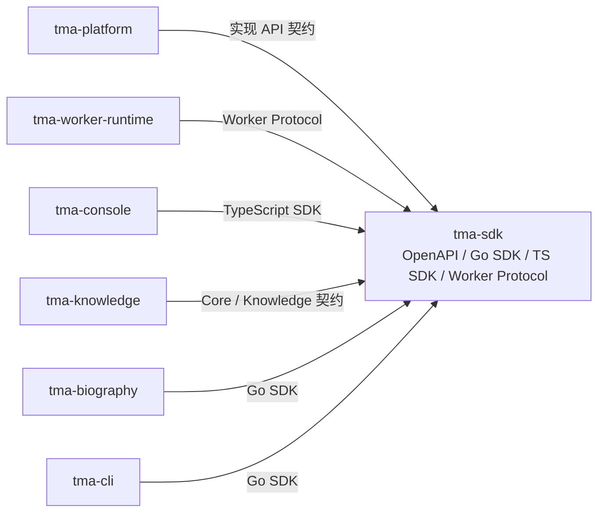
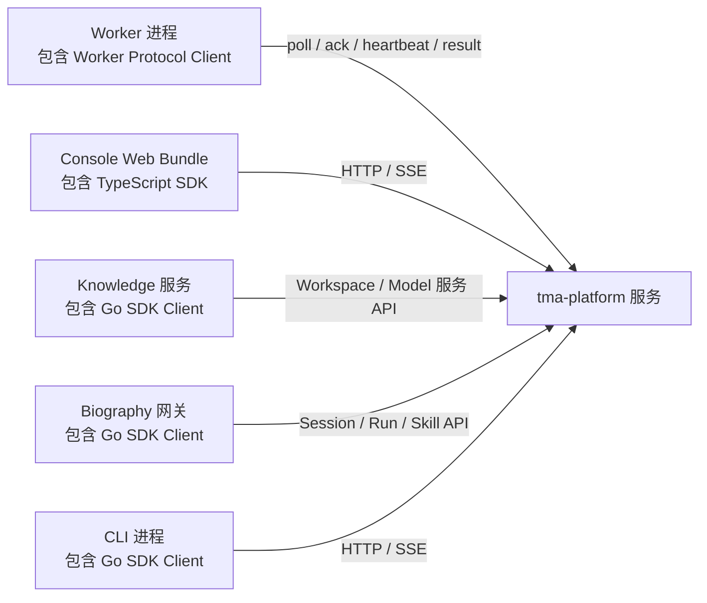

# 仓库拆分方案

拆分工作开始前，本仓库同时承载控制面、执行面、多个 Web 产品、SDK 和自传业务。
Biography 已经先行迁出；其余模块短期继续使用 monorepo 便于联调。本文件定义目标仓库、
暂时保留的边界以及迁移顺序。

## 目标仓库

| 仓库 | 负责内容 | 发布单元 | 依赖方向 |
| --- | --- | --- | --- |
| `tma-platform` | `tma-server`、Agent/Session/Run 控制面、Postgres Store、API Handler、SQL 迁移 | `tma-server` + 数据库迁移 | 只依赖版本化 API/SDK 契约 |
| `tma-worker-runtime` | `tma-worker`、Worker 协议、Capability Provider、沙箱和插件执行 | `tma-worker`、运行时镜像 | 依赖 Worker 协议和工具 Schema |
| `tma-console` | Workbench、Inspector、Space | Web 静态资源 | 依赖 TypeScript SDK |
| `tma-knowledge` | 知识库管理、文档摄取、检索问答、公开分享和 Knowledge Web | Knowledge API + Web 静态资源 | 依赖平台身份/Workspace 契约、模型服务和对象存储契约 |
| `tma-biography` | 自传移动端、语音网关、自传 Agent bootstrap、录音和章节业务 | 移动端 + `tma-biography-voice-gateway` | 通过 SDK/API 依赖平台，不依赖平台 `internal` 包 |
| `tma-sdk` | OpenAPI v2、事件 Schema、Go SDK、TypeScript SDK | SDK 包和 API 契约版本 | 不依赖具体 Server 实现 |
| `tma-cli` | 登录凭据、Session/Agent/Worker/Skill/Trace 等终端命令 | `tma` 可执行文件和安装包 | 只依赖 Go SDK 和公开协议类型 |

`tma-extensions`（浏览器网关、OnlyBoxes、R Notebook、示例插件）暂时作为独立发布目录
维护；只有在插件 ABI 和镜像发布频率明显独立后再建立独立仓库。

## 模块依赖关系

`tma-sdk` 是被编译或打包进调用方的代码库，不是独立运行的服务。源码依赖和运行时网络
调用需要分开看；下面两张图中的箭头都从调用方指向被依赖方。

构建期依赖：



运行时调用：SDK 已经包含在各自进程或 Web Bundle 内，真正跨网络的是这些进程与服务。



`tma-sdk` 只包含契约、生成类型、客户端和协议类型，不包含数据库访问或服务端业务实现。
Platform 实现 Core API；Knowledge 拥有自己的 API 和前端；Biography 拥有移动端和语音
网关。生产入口的 API Gateway 可以把 `/v2/knowledge/*` 路由到 Knowledge，但这不形成
Platform 对 Knowledge 的源码依赖。

| 项目 | 数据所有权 |
| --- | --- |
| `tma-platform` | Workspace、Agent、Environment、Session、Turn、Run、Event、Worker、Skill、Trace、Artifact 元数据 |
| `tma-knowledge` | Knowledge Base、Document、Chunk、Knowledge Service、Share、Question Audit 和独立对象存储前缀/桶 |
| `tma-biography` | 自传项目、章节、录音、录音分段、采访进度和独立对象存储前缀/桶 |
| `tma-worker-runtime` | 临时执行状态和受限本地 Workspace；不拥有平台业务数据库 |
| `tma-console`、`tma-cli` | 仅客户端状态和凭据；不直接访问任何服务数据库 |
| `tma-sdk` | 无运行时数据 |

跨项目不能直接查询或更新对方的数据表。需要联动时使用 API、事件或版本化协议；即使
多个服务暂时部署在同一个 PostgreSQL 实例，也要使用独立 Schema、运行角色和迁移所有权。

## 当前目录映射

第一阶段不移动代码，只建立映射和依赖规则：

```text
platform:  cmd/tma-server, internal/{agent*,httpapi,managedagents,runner,...},
           sql/ 中除独立业务迁移外的 Platform Schema
worker:    cmd/tma-worker, internal/{capability,execution,tools,workruntime,workerselect}
console:   apps/{workbench,inspector,space}
knowledge: apps/knowledge, internal/httpapi/knowledge_service.go,
           internal/managedagents/knowledge_service.go,
           api/v2 中 /v2/knowledge/* 与 /v2/public/knowledge-shares/* 契约，
           sql/migrations/{000097_knowledge_service,
                           000098_knowledge_share_history,
                           000099_knowledge_service_documents}.sql
biography: 已迁移到独立的 tma-biography 项目；Platform 不再保留其源码、
           业务迁移、移动端、Skills 或镜像构建目标
sdk:       api/v2, sdk/tma, sdk/typescript
cli:       cmd/tma
```

目录映射不是最终的拆分方式。`internal/managedagents`、`internal/objectstore` 等平台包被
多个边界使用，迁移时必须先通过 API、协议或独立公共包替换直接 Go import。

## 必须保持的边界

1. Biography 只能调用公开 HTTP API/SDK。`tma-biography` 不得导入 `internal/httpapi`、
   `internal/managedagents` 或其他平台实现包。
2. Worker 不能直连 PostgreSQL。Worker 与 Platform 之间只使用版本化的 Worker HTTP
   协议和工具/能力 Schema。
3. Console 不复制 OpenAPI 类型。所有 API 类型、SSE 解析和分页契约来自 `tma-sdk`。
4. Knowledge 拥有自己的知识库、文档、Chunk、服务和分享数据；Platform 不能直接读写
   Knowledge 表。Workspace 身份、模型调用和对象引用通过版本化契约集成。
5. 每个服务拥有自己的业务 Schema 和迁移包。迁移可以由统一部署流程编排，但不能由服务
   启动时隐式执行，也不能跨服务直接修改对方的数据表。
6. SDK 的破坏性变更必须先更新契约版本，再更新 Platform、Console、Knowledge 和
   Biography 的消费方。
7. CLI 只能通过 Go SDK 或公开 HTTP/事件协议访问 Platform，不能导入 `internal/tools`、
   `internal/observability`、`internal/serverconfig` 等服务端实现包。

## 迁移顺序

### 0. 基线（当前阶段）

- 保持当前 monorepo 可构建、可测试、可部署。
- 将边界规则写入各项目的 CI 检查，禁止新增跨边界 `internal` import。
- 为 Worker 协议和 Biography 网关补充独立的契约测试。

### 1. 抽离 Biography

状态：已完成本地独立项目切换。`tma-biography` 现在独立拥有：

- `apps/biography-mobile`
- `cmd/tma-biography-voice-gateway`
- `cmd/tma-biography-agent-bootstrap`
- `internal/biographyvoice` 中与网关相关的业务代码
- 三个 Biography Skills 和 `000103`、`000104` 两条 SQL 迁移

已完成的边界改造：

- 对象存储和 `.env` 加载由 Biography 自己实现，不再导入 Platform `internal` 包；
- TMA 调用只依赖 vendored Go SDK，SDK 发布独立版本后再替换临时本地刷新路径；
- 网关、Agent bootstrap、移动端、数据库迁移、OIDC Client 和 Docker 镜像均由
  Biography 项目构建和验证；
- Platform 的旧源码、迁移、Keycloak Client 和生产 Compose 服务已移除，并由边界检查
  阻止重新引入。

### 2. 建立并抽离 Knowledge 服务

Knowledge 目前不只是前端，核心实现还嵌在 `internal/httpapi` 和 `internal/managedagents`。
先建立独立的 Knowledge 应用层和 Store 接口，再迁移以下能力：

- `/v2/knowledge/*` 和 `/v2/public/knowledge-shares/*` API；
- 文档上传、文本提取、切块、Embedding、检索、问答和联网补充；
- 知识库、文档、Chunk、服务、分享及问答审计数据；
- `apps/knowledge` 和 `000097` 至 `000099` 三条迁移。

迁移期间由 Platform API Gateway 代理原路径，外部客户端不更换 URL。Knowledge 不直接
读取 Platform 数据库；Workspace 身份、LLM 和对象存储通过服务凭据及明确契约接入。

### 3. 抽离 Console

将 Workbench、Inspector、Space 和共享的前端构建配置迁移到 `tma-console`。Server 只保留构建产物的
可选嵌入能力，生产部署优先使用独立静态站点/CDN。

### 4. 抽离 SDK/契约

把 OpenAPI、事件 Schema、Go SDK 和 TypeScript SDK 变成独立版本库。Platform 发布 API
时引用固定 SDK/契约版本，避免 Server 构建过程依赖工作区相对路径。

### 5. 抽离 CLI

CLI 当前直接依赖 `internal/tools`、`internal/observability` 和 `internal/serverconfig`。
先把命令输出使用的 DTO、Trace 类型和工具调用格式迁入 Go SDK 或 CLI 自有包，再迁移
`cmd/tma`。OIDC Device Flow、系统 Keychain、配置文件和二进制发布由 `tma-cli` 自己维护。

### 6. 抽离 Worker

当 Worker HTTP 协议、工具 Schema 和 Capability Provider 已有兼容性测试后，再迁移
`tma-worker` 和运行时镜像。Platform 保留队列、租约和结果回写；Worker 不携带数据库模型。

## 当前不做的事情

- 不把每个 `internal` 包拆成单独 Go module。
- 不在没有协议版本和契约测试前拆 Server/Worker。
- 不让 Biography 直接复用平台数据库 Store 实现。
- 不把 Knowledge 只当作静态前端拆走并继续跨仓库操作 Platform 数据库。
- 不把 CLI 放进 SDK 包；SDK 是库，CLI 是独立版本和安装渠道的可执行产品。
- 不为了拆仓库重写现有 API 或改变 Session/Turn 持久化语义。

## 验收标准

拆分完成后，下面四条命令应分别在对应仓库执行，不需要读取其他仓库源码：

```bash
make test-platform
make test-worker
make test-console
make test-knowledge
make test-biography
make test-sdk
make test-cli
```

跨仓库联调只允许通过已发布的 API、SDK、Worker 协议或容器镜像完成。
