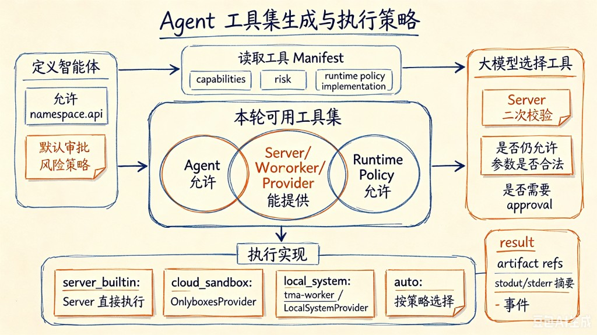
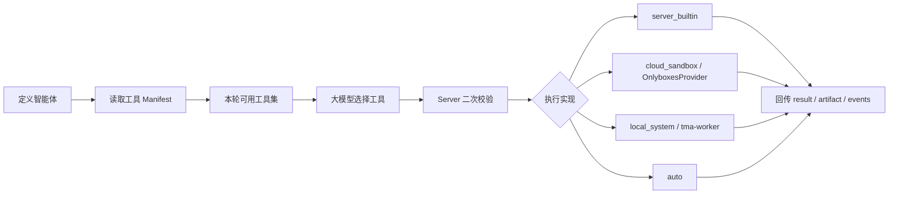

# 产品设计架构图梳理

## Agent 工具集成与执行策略



### 流程概览

1. **定义智能体**：指定允许哪些 `namespace.api` 工具，以及默认审批/风险策略。
2. **读取工具 manifest**：每个工具声明 `capabilities` / `risk` / `runtime policy` / `implementation`。
3. **运行时生成「本轮可用工具集」**：
   - `agent 允许` ∩ `当前 server/worker/provider 能提供` ∩ `runtime policy 允许`
4. **把可用工具集发给大模型**，让模型选择工具。
5. **模型返回 tool call 后，server 再校验一次**：这个工具是否仍允许、参数是否合法、是否需要 approval。
6. **根据 runtime 优先级和 capabilities 选择执行实现**：
   - `server_builtin` → Server 直接执行
   - `cloud_sandbox` → `OnlyboxesProvider`
   - `local_system` → 本机 `tma-worker` / `LocalSystemProvider`
   - `auto` → 按策略选最合适实现
7. **provider / worker 执行**，回传 result、artifact refs、stdout/stderr 摘要和事件。



---

## cloud_sandbox：Onlyboxes 部署与接入

当执行实现选择 `cloud_sandbox` 时，底层由 **OnlyboxesProvider** 承接。Onlyboxes 不在 TMA 仓库内，是一套独立项目：**Console（控制面）** 负责 API、鉴权与 Worker 调度；**Worker（执行面）** 在 Docker 或 boxlite 中运行真实命令。

官方文档：

- [Install](https://onlybox.es/en/docs/install/)
- [Quick Start](https://onlybox.es/en/docs/quick-start/)
- [Console Config](https://onlybox.es/en/docs/console-config/)
- [Console API](https://onlybox.es/en/docs/console-api/)

### 架构概览

```text
┌─────────────────────────────────────────────────────────────┐
│  上游应用 / Remote Provider                                  │
│  - 调用 Console REST API                                     │
│  - 提交命令并读取执行结果                                     │
└──────────────────────────┬──────────────────────────────────┘
                           │ HTTPS
                           ▼
┌─────────────────────────────────────────────────────────────┐
│  Onlyboxes Console（控制面）                                  │
│  - HTTP :8089  Dashboard + REST API                          │
│  - gRPC :50051 Worker 注册与任务调度                           │
│  - API 鉴权与任务调度                                         │
└──────────────────────────┬──────────────────────────────────┘
                           │ gRPC
                           ▼
┌─────────────────────────────────────────────────────────────┐
│  Onlyboxes Worker（执行面）                                   │
│  - worker-docker 或 boxlite 运行时                           │
│  - 在隔离环境中执行 Shell / Python / Node 等命令              │
└─────────────────────────────────────────────────────────────┘
```

TMA 当前通过 `cloud_sandbox` 模式在本地 Docker 中执行命令，后续可扩展为直连 Onlyboxes Console。

### 环境要求

| 组件 | 要求 |
|------|------|
| 操作系统 | Linux 或 macOS（一键安装脚本支持） |
| 容器 | Docker + Docker Compose v2（推荐）；无 Docker 时可选 boxlite |
| 其他 | Python 3（安装脚本依赖）、systemd（一键安装用于 Worker 服务） |
| 网络 | 能访问 GitHub Releases 与 `onlybox.es`（下载安装脚本与二进制） |

### 方式一：一键安装（推荐）

适用于单机快速试用或 PoC。

```bash
curl -fsSL https://onlybox.es/install.sh | bash
```

安装脚本会自动完成：

1. 检查 Linux/macOS、Docker、Compose v2、systemd
2. 下载 compose 模板并生成初始凭证
3. 以 `docker compose up -d` 启动 Console
4. 创建 `normal` 类型 Worker
5. 下载与架构匹配的 Worker 二进制（Docker 或 boxlite）
6. 生成并启用 systemd 服务
7. 轮询直到 Worker 上线，打印访问地址与管理员账号

常用参数：

```bash
# 指定工作目录、非交互安装
curl -fsSL https://onlybox.es/install.sh | bash -s -- \
  --yes \
  --workdir /opt/onlyboxes

# 自定义 Console 端口
curl -fsSL https://onlybox.es/install.sh | bash -s -- \
  --console-http-port 18089 \
  --console-grpc-port 50052

# 固定版本
curl -fsSL https://onlybox.es/install.sh | bash -s -- --tag 0.7.1

# 无 Docker 时强制 boxlite 运行时
curl -fsSL https://onlybox.es/install.sh | bash -s -- --worker-runtime boxlite
```

安装后验证：

1. 浏览器打开 `http://127.0.0.1:8089`（或你配置的端口）
2. 使用安装输出中的管理员账号登录
3. 在 **Workers** 页面确认 Worker 状态为 **online**

### 方式二：手动安装

适合需要自定义 compose、多节点或生产环境分层的场景。

#### 1. 启动 Console

```yaml
# docker-compose.yml（示意，以官方 release 模板为准）
services:
  console:
    image: coolfan1024/onlyboxes:latest
    ports:
      - "8089:8089"
      - "50051:50051"
    environment:
      CONSOLE_HTTP_ADDR: ":8089"
      CONSOLE_GRPC_ADDR: ":50051"
      CONSOLE_HASH_KEY: "<随机生成的 HMAC 密钥>"
      CONSOLE_DASHBOARD_PASSWORD: "<管理员密码>"
    volumes:
      - ./db:/app/db
```

```bash
docker compose up -d
```

首次启动若无管理员账号，Console 会在日志中打印随机生成的管理员凭证。

#### 2. 创建 Worker

1. 登录 Dashboard → **Workers** → 创建 Worker
2. 记录返回的 **worker_id**、**worker_secret** 与启动命令

#### 3. 下载并启动 Worker 二进制

从 [GitHub Releases](https://github.com/onlyboxes/onlyboxes/releases) 下载对应架构的 `worker-docker`（或 boxlite 版本）：

```bash
WORKER_CONSOLE_INSECURE=true \
WORKER_CONSOLE_GRPC_TARGET=127.0.0.1:50051 \
WORKER_ID=<worker_id> \
WORKER_SECRET=<worker_secret> \
/path/to/onlyboxes-worker-docker
```

生产环境应去掉 `WORKER_CONSOLE_INSECURE=true`，并为 gRPC 配置 TLS。

#### 4. 确认 Worker 在线

Dashboard 中 Worker 状态应为 **online**，否则远程执行调用会失败。

### Console 关键配置

| 变量 | 必填 | 默认值 | 说明 |
|------|------|--------|------|
| `CONSOLE_HTTP_ADDR` | 否 | `:8089` | Dashboard + REST API 监听地址 |
| `CONSOLE_GRPC_ADDR` | 否 | `:50051` | Worker 注册 gRPC 监听地址 |
| `CONSOLE_HASH_KEY` | **是** | - | Worker secret 与 access token 的 HMAC 哈希密钥 |
| `CONSOLE_DB_PATH` | 否 | `./db/onlyboxes-console.db` | SQLite 数据库路径 |
| `CONSOLE_DASHBOARD_USERNAME` | 否 | - | 首次初始化管理员用户名 |
| `CONSOLE_DASHBOARD_PASSWORD` | 否 | - | 首次初始化管理员密码 |

### 接入 TMA

TMA 当前把 `cloud_sandbox` runtime 落到 `OnlyboxesProvider`。当前实现通过本地 Docker 隔离执行工具命令：Session 第一次调用按 scope 执行 `docker run -d` 创建容器，后续调用通过 `docker exec` 复用，挂载 workspace 到 `/workspace`，并按空闲 TTL 或最大寿命回收。TMA 不自动启动 Docker daemon 或 Onlyboxes Console；Onlyboxes Console 可作为后续 Remote Provider 的执行后端。

```bash
TMA_CLOUD_SANDBOX_ROOT=.
TMA_CLOUD_SANDBOX_IMAGE=coolfan1024/onlyboxes-runtime:default
```

Session 级 `runtime_settings` 中的 `tool_runtime` / `cloud_sandbox_root` / `cloud_sandbox_image` 可覆盖上述启动默认值，无需重启服务。

| 模式 | 当前状态 |
|------|----------|
| TMA `cloud_sandbox` | 本地 Docker 隔离，不经过 Onlyboxes Console |
| TMA 未来 Remote Provider | 计划直连 Onlyboxes Console |

### 生产部署建议

**网络与安全：**

- Console HTTP API 应置于反向代理（Nginx / Caddy）之后，启用 HTTPS
- 限制 Console Dashboard 与 gRPC 端口的访问来源（防火墙 / 内网）
- 使用强随机值生成 `CONSOLE_HASH_KEY`
- Worker 与 Console 之间的 gRPC 在生产环境启用 TLS，去掉 `WORKER_CONSOLE_INSECURE`

**高可用：**

- Console：SQLite 适合单机；多实例需查阅 Onlyboxes 官方对数据库的后端支持情况
- Worker：可按负载水平扩展多个 Worker 节点，在 Dashboard 分别注册
- 为 Worker 配置资源限制（CPU、内存、磁盘），避免单任务耗尽节点

**同机 / 分机部署：**

```text
# 单机（开发 / PoC）
Onlyboxes Console (:8089)
        │
        └── Worker (127.0.0.1:50051)

# 多节点（生产）
Onlyboxes Console
        │
        ├── Worker 节点 A
        └── Worker 节点 B
```

### 监控与排障

| 现象 | 可能原因 | 处理 |
|------|----------|------|
| 命令超时 | 默认 120s | 调整命令 timeout 或检查 Worker 负载 |
| Worker offline | Worker 进程未启动或 gRPC 不可达 | 检查 systemd 服务与 `:50051` 连通性 |

### 最小配置速查

**TMA（本地 Docker 模式）：**

```bash
TMA_CLOUD_SANDBOX_ROOT=.
TMA_CLOUD_SANDBOX_IMAGE=coolfan1024/onlyboxes-runtime:default
```

### 相关文档

- [TMA 配置说明](./configuration.md)
- [TMA 能力 Provider 设计](./capability-provider.md)
- [TMA 产品差距与路线图](./product-gap-roadmap.md)
- [Onlyboxes 官方 Install 文档](https://onlybox.es/en/docs/install/)
- [Onlyboxes GitHub 仓库](https://github.com/Coooolfan/onlyboxes)
